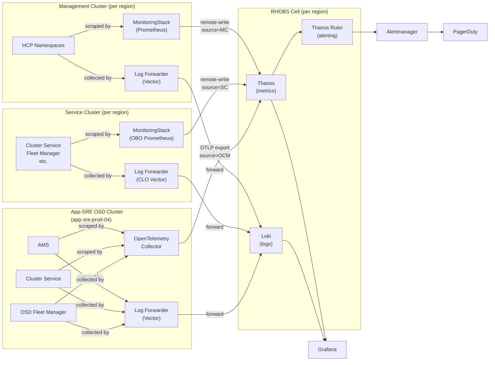

# RHOBS Developer Quick Start

A practical guide for SRE and development teams using RHOBS to monitor ROSA HCP workloads. Covers querying metrics and logs, building dashboards, understanding alerting, and troubleshooting collection issues.

## What is RHOBS?

RHOBS (Red Hat Observability Service) is the regional observability platform for ROSA HCP. It replaces Dynatrace for metrics, logs, and synthetic monitoring.



**Key concepts:**
- Each AWS region has one or more RHOBS **cells** (Thanos + Loki + Alertmanager)
- **Management Clusters** remote-write metrics and forward logs to their regional cell
- **Service Clusters** use the same collection stack (OBO + CLO) as MCs, sending metrics/logs to their regional cell
- **App-SRE OSD clusters** (hosting AMS, CS, OSDFM) send metrics/logs to the us-east-1 cell
- HCP metrics carry `_id` (cluster ID), `_mc_id` (MC ID), and `namespace` (HCP namespace) labels
- OCM component metrics carry `source="OCM"` to distinguish from HCP metrics
- All data is queryable via Grafana at `https://grafana.app-sre.devshift.net`

## Querying metrics (PromQL)

### Grafana access

1. Go to [Grafana](https://grafana.app-sre.devshift.net/?orgId=1)
2. Select a datasource matching the cell: `rhobs-<region>-<shard>-production-hcp-metrics`
   - Example: `rhobs-us-west-2-0-production-hcp-metrics`
3. Use **Explore** for ad-hoc PromQL queries

### Datasource naming

Format: `rhobs-<aws_region>-<shard>-<environment>-hcp-metrics`

| Region | Shard | Metrics | Logs |
|--------|-------|---------|------|
| us-east-1 | 0 | [rhobs-us-east-1-0-production-hcp-metrics](https://grafana.app-sre.devshift.net/explore?schemaVersion=1&panes=%7B%22a%22%3A%7B%22datasource%22%3A%22rhobs-us-east-1-0-production-hcp-metrics%22%7D%7D&orgId=1) | [rhobs-us-east-1-0-production-hcp-logs](https://grafana.app-sre.devshift.net/explore?schemaVersion=1&panes=%7B%22a%22%3A%7B%22datasource%22%3A%22rhobs-us-east-1-0-production-hcp-logs%22%7D%7D&orgId=1) |
| us-east-1 | 1 | [rhobs-us-east-1-1-production-hcp-metrics](https://grafana.app-sre.devshift.net/explore?schemaVersion=1&panes=%7B%22a%22%3A%7B%22datasource%22%3A%22rhobs-us-east-1-1-production-hcp-metrics%22%7D%7D&orgId=1) | [rhobs-us-east-1-1-production-hcp-logs](https://grafana.app-sre.devshift.net/explore?schemaVersion=1&panes=%7B%22a%22%3A%7B%22datasource%22%3A%22rhobs-us-east-1-1-production-hcp-logs%22%7D%7D&orgId=1) |
| us-east-1 | 2 | [rhobs-us-east-1-2-production-hcp-metrics](https://grafana.app-sre.devshift.net/explore?schemaVersion=1&panes=%7B%22a%22%3A%7B%22datasource%22%3A%22rhobs-us-east-1-2-production-hcp-metrics%22%7D%7D&orgId=1) | [rhobs-us-east-1-2-production-hcp-logs](https://grafana.app-sre.devshift.net/explore?schemaVersion=1&panes=%7B%22a%22%3A%7B%22datasource%22%3A%22rhobs-us-east-1-2-production-hcp-logs%22%7D%7D&orgId=1) |
| us-west-2 | 0 | [rhobs-us-west-2-0-production-hcp-metrics](https://grafana.app-sre.devshift.net/explore?schemaVersion=1&panes=%7B%22a%22%3A%7B%22datasource%22%3A%22rhobs-us-west-2-0-production-hcp-metrics%22%7D%7D&orgId=1) | [rhobs-us-west-2-0-production-hcp-logs](https://grafana.app-sre.devshift.net/explore?schemaVersion=1&panes=%7B%22a%22%3A%7B%22datasource%22%3A%22rhobs-us-west-2-0-production-hcp-logs%22%7D%7D&orgId=1) |
| eu-west-1 | 0 | [rhobs-eu-west-1-0-production-hcp-metrics](https://grafana.app-sre.devshift.net/explore?schemaVersion=1&panes=%7B%22a%22%3A%7B%22datasource%22%3A%22rhobs-eu-west-1-0-production-hcp-metrics%22%7D%7D&orgId=1) | [rhobs-eu-west-1-0-production-hcp-logs](https://grafana.app-sre.devshift.net/explore?schemaVersion=1&panes=%7B%22a%22%3A%7B%22datasource%22%3A%22rhobs-eu-west-1-0-production-hcp-logs%22%7D%7D&orgId=1) |
| eu-central-1 | 0 | [rhobs-eu-central-1-0-production-hcp-metrics](https://grafana.app-sre.devshift.net/explore?schemaVersion=1&panes=%7B%22a%22%3A%7B%22datasource%22%3A%22rhobs-eu-central-1-0-production-hcp-metrics%22%7D%7D&orgId=1) | [rhobs-eu-central-1-0-production-hcp-logs](https://grafana.app-sre.devshift.net/explore?schemaVersion=1&panes=%7B%22a%22%3A%7B%22datasource%22%3A%22rhobs-eu-central-1-0-production-hcp-logs%22%7D%7D&orgId=1) |
| ap-northeast-1 | 0 | [rhobs-ap-northeast-1-0-production-hcp-metrics](https://grafana.app-sre.devshift.net/explore?schemaVersion=1&panes=%7B%22a%22%3A%7B%22datasource%22%3A%22rhobs-ap-northeast-1-0-production-hcp-metrics%22%7D%7D&orgId=1) | [rhobs-ap-northeast-1-0-production-hcp-logs](https://grafana.app-sre.devshift.net/explore?schemaVersion=1&panes=%7B%22a%22%3A%7B%22datasource%22%3A%22rhobs-ap-northeast-1-0-production-hcp-logs%22%7D%7D&orgId=1) |
| ap-southeast-2 | 0 | [rhobs-ap-southeast-2-0-production-hcp-metrics](https://grafana.app-sre.devshift.net/explore?schemaVersion=1&panes=%7B%22a%22%3A%7B%22datasource%22%3A%22rhobs-ap-southeast-2-0-production-hcp-metrics%22%7D%7D&orgId=1) | [rhobs-ap-southeast-2-0-production-hcp-logs](https://grafana.app-sre.devshift.net/explore?schemaVersion=1&panes=%7B%22a%22%3A%7B%22datasource%22%3A%22rhobs-ap-southeast-2-0-production-hcp-logs%22%7D%7D&orgId=1) |
| sa-east-1 | 0 | [rhobs-sa-east-1-0-production-hcp-metrics](https://grafana.app-sre.devshift.net/explore?schemaVersion=1&panes=%7B%22a%22%3A%7B%22datasource%22%3A%22rhobs-sa-east-1-0-production-hcp-metrics%22%7D%7D&orgId=1) | [rhobs-sa-east-1-0-production-hcp-logs](https://grafana.app-sre.devshift.net/explore?schemaVersion=1&panes=%7B%22a%22%3A%7B%22datasource%22%3A%22rhobs-sa-east-1-0-production-hcp-logs%22%7D%7D&orgId=1) |

### Common queries

**Find metrics for a specific HCP cluster:**

```promql
# By cluster ID
up{_id="<cluster-id>"}

# By cluster name (if available via hypershift labels)
hypershift_cluster_vcpus{label_api_openshift_com_name="<cluster-name>"}
```

**Check if metrics are flowing from an MC:**

```promql
# Count HCPs reporting from an MC
count by (_mc_id, mc_name) (hypershift_cluster_vcpus)
```

**kube-apiserver health:**

```promql
# API server pods ready
sre:kube_apiserver:pod_status_ready{_id="<cluster-id>"}

# Probe success (synthetic monitoring)
probe_success{_id="<cluster-id>"}
```

**Node resource usage:**

```promql
# Request serving node CPU
sre:node_request_serving:excessive_consumption_cpu
```

**Error budget burn rate:**

```promql
# Current API error budget burn (5m/1h windows)
http_requests:burnrate5m{handler="receive", job="rhobs-gateway"}
```

## Querying logs (LogQL)

### Grafana log datasources

Format: `rhobs-<aws_region>-<shard>-<environment>-hcp-logs`

Example: `rhobs-us-west-2-0-production-hcp-logs`

### HCP log queries

**Logs from a specific HCP namespace:**

```logql
{k8s_namespace_name=~"ocm-.*-<cluster-name>"} | json
```

**kube-apiserver errors for a cluster:**

```logql
{k8s_namespace_name=~"ocm-.*-<cluster-name>", k8s_container_name="kube-apiserver"}
  | json
  | level="error"
```

**Search across all HCPs on an MC:**

```logql
{_mc_id="<mc-id>"} | json | line_format "{{.message}}" |= "error"
```

**Rate of errors over time:**

```logql
sum by (k8s_container_name) (
  rate({k8s_namespace_name=~"ocm-.*-<cluster-name>"} | json | level="error" [5m])
)
```

### OCM component log queries (AMS, CS, OSDFM)

OCM components run on app-sre OSD clusters and forward logs to the us-east-1 RHOBS cell. They use the same HCP tenant datasources.

| Component | Production Namespace | Stage Namespace |
|-----------|---------------------|-----------------|
| AMS (Account Management Service) | `uhc-production` | `uhc-stage` |
| CS (Cluster Service) | `uhc-production` | `uhc-stage` |
| OSDFM (OSD Fleet Manager) | `osd-fleet-manager-production` | `osd-fleet-manager-stage` |

**Production**: [rhobs-us-east-1-0-production-hcp-logs](https://grafana.app-sre.devshift.net/explore?schemaVersion=1&panes=%7B%22a%22%3A%7B%22datasource%22%3A%22rhobs-us-east-1-0-production-hcp-logs%22%2C%22queries%22%3A%5B%7B%22refId%22%3A%22A%22%2C%22expr%22%3A%22%7Bk8s_namespace_name%3D~%5C%22uhc-production%7Cosd-fleet-manager-production%5C%22%7D%22%2C%22queryType%22%3A%22range%22%7D%5D%7D%7D&orgId=1)
**Stage**: [rhobs-us-east-1-stage-hcp-logs](https://grafana.app-sre.devshift.net/explore?schemaVersion=1&panes=%7B%22a%22%3A%7B%22datasource%22%3A%22rhobs-us-east-1-stage-hcp-logs%22%2C%22queries%22%3A%5B%7B%22refId%22%3A%22A%22%2C%22expr%22%3A%22%7Bk8s_namespace_name%3D~%5C%22uhc-stage%7Cosd-fleet-manager-stage%5C%22%7D%22%2C%22queryType%22%3A%22range%22%7D%5D%7D%7D&orgId=1)

**All OCM component logs (production):**

```logql
{k8s_namespace_name=~"uhc-production|osd-fleet-manager-production"}
```

**AMS/CS errors:**

```logql
{k8s_namespace_name="uhc-production"} |= "error" | json
```

**OSDFM errors:**

```logql
{k8s_namespace_name="osd-fleet-manager-production"} |= "error" | json
```

**Filter by pod name pattern (e.g., CS pods):**

```logql
{k8s_namespace_name="uhc-production", k8s_pod_name=~"clusters-service.*"} | json
```

**Error rate by container:**

```logql
sum by (k8s_container_name) (
  rate({k8s_namespace_name="uhc-production"} | json | level="error" [5m])
)
```

**Stage environment:**

```logql
{k8s_namespace_name=~"uhc-stage|osd-fleet-manager-stage"} |= "error"
```

### OCM component metrics

OCM metrics are labeled with `source="OCM"` to distinguish from HCP metrics:

```promql
# All OCM component metrics
up{source="OCM"}

# Deployment replicas
kube_deployment_spec_replicas{source="OCM", namespace="uhc-production"}

# Pod restarts
kube_pod_container_status_restarts_total{source="OCM", namespace="uhc-production"}
```

**Production**: [rhobs-us-east-1-0-production-hcp-metrics](https://grafana.app-sre.devshift.net/explore?schemaVersion=1&panes=%7B%22a%22%3A%7B%22datasource%22%3A%22rhobs-us-east-1-0-production-hcp-metrics%22%2C%22queries%22%3A%5B%7B%22refId%22%3A%22A%22%2C%22expr%22%3A%22up%7Bsource%3D%5C%22OCM%5C%22%7D%22%7D%5D%7D%7D&orgId=1)
**Stage**: [rhobs-us-east-1-stage-hcp-metrics](https://grafana.app-sre.devshift.net/explore?schemaVersion=1&panes=%7B%22a%22%3A%7B%22datasource%22%3A%22rhobs-us-east-1-stage-hcp-metrics%22%2C%22queries%22%3A%5B%7B%22refId%22%3A%22A%22%2C%22expr%22%3A%22up%7Bsource%3D%5C%22OCM%5C%22%7D%22%7D%5D%7D%7D&orgId=1)

### Collection clusters

| Environment | Cluster | RHOBS Cell URL |
|-------------|---------|---------------|
| Stage | app-sre-stage-01 | `https://us-east-1-0.rhobs.api.stage.openshift.com` |
| Production | app-sre-prod-04 | `https://us-east-1-0.rhobs.api.openshift.com` |
```

## Dashboards

### Central ROSA HCP Dashboard

The main dashboard for investigating HCP cluster health:

[RHOBS.Next Central ROSA HCP Dashboard](https://grafana.app-sre.devshift.net/d/cf6ntunq7rb40c/rhobs-next-central-rosa-hcp-dashboard?orgId=1)

Variables at the top:
- **Environment**: production / staging / integration
- **Region**: AWS region
- **Shard**: Cell shard (0 for most regions, 0/1/2 for us-east-1)
- **HCP Cluster ID**: The `_id` of the cluster to investigate

Sections:
- **Overview**: Cluster info, limited support status, firing alerts
- **Synthetic Monitoring**: Probe availability and duration
- **Request Serving Nodes**: CPU/memory consumption per node
- **Request Serving Components**: Per-component resource usage
- **etcd**: Leader elections, DB size, WAL

### Building your own dashboard

1. Use the `rhobs-<region>-<shard>-production-hcp-metrics` datasource
2. Filter by `_id` for per-cluster views, `_mc_id` for per-MC views
3. For log panels, use the corresponding `-hcp-logs` datasource
4. Use template variables for region/shard/cluster selection

### Dashboard promotion

Dashboards in the [osd-rhobs-rules-and-dashboards](https://github.com/openshift/osd-rhobs-rules-and-dashboards) repo deploy via app-interface saas file:
- Stage: `ref: main` (auto-deploy on merge)
- Production: pinned SHA (manual promotion)

## Understanding alerting

### How alerts fire

1. Thanos Ruler on each RHOBS cell evaluates PrometheusRule definitions
2. Firing alerts go to the cell's Alertmanager
3. Alertmanager routes to PagerDuty based on severity and alert_group labels
4. PD incidents include dashboard links, OCM links, and SOP links

### Alert suppression

Alerts are suppressed (not fired) for clusters that are:
- **Installing** (`hypershift_cluster_waiting_initial_avaibility_duration_seconds` exists)
- **Deleting** (`hypershift_cluster_deleting_duration_seconds` exists)
- **Limited support** (`hypershift_cluster_limited_support_enabled == 1`)
- **Silenced** (`hypershift_cluster_silence_alerts == 1`)

These are combined into the `sre:hcp:alerts_suppressed` recording rule. Alert expressions use:

```promql
<expression> unless on (_id) sre:hcp:alerts_suppressed
```

### Alert severity levels

| Severity | PD behavior | Use case |
|----------|------------|----------|
| `critical` | Pages on-call SRE | Customer-impacting, needs immediate action |
| `warning` | Creates PD incident (no page) | Needs attention but not urgent |
| `soaking` | Silent PD service | New/unvalidated alerts, tuning phase |

### Checking alert status

**Via PagerDuty**: RHOBS alerts have prefix `[HCP] [RHOBS]` in the incident title.

**Via Grafana**: Use the Explore view with the appropriate metrics datasource and query the `ALERTS` metric:

```promql
# All currently firing alerts
ALERTS{alertstate="firing"}

# Specific alert
ALERTS{alertname="KubeAPIServerDown", alertstate="firing"}

# Alerts for a specific cluster
ALERTS{_id="<cluster-id>", alertstate="firing"}
```

## Troubleshooting

### "My metrics aren't showing up in Grafana"

1. **Check the datasource** -- make sure you're using the right region and shard. See the [datasource table](#datasource-naming) above.

2. **Verify the metric name** -- try a broad query first:
   ```promql
   # Search for metrics matching a pattern
   count({__name__=~".*my_metric.*"})
   ```

3. **Check if the metric is in the allowlist** -- the MonitoringStack only remote-writes metrics that match the allowlist regex. The current allowlist is in `resources/collection/metrics/hypershift-monitoring-stack-template.yaml`. Search for your metric name in that file.

4. **Check for the `source` label** -- OCM component metrics use `source="OCM"`, HCP metrics use `source="MC"`:
   ```promql
   up{source="OCM"}   # OCM components (AMS, CS, OSDFM)
   up{source="MC"}    # HCP management cluster metrics
   ```

5. **If the metric should be there but isn't**, open a Jira to the SREP Observability team requesting the metric be added to the allowlist. Include the metric name, which component produces it, and why you need it.

### "My metric exists on the MC but not in RHOBS"

The MonitoringStack only remote-writes metrics matching its allowlist. If your metric isn't included:

1. Check the allowlist in `resources/collection/metrics/hypershift-monitoring-stack-template.yaml` -- search for your metric name in the `writeRelabelConfigs` regex patterns
2. If it's not there, submit an MR to add it. The metric name must be added to the `keep` regex pattern in the `writeRelabelConfigs` section.
3. After merging, the change deploys to integration/stage automatically. Production requires a promotion (see [Promotion SOP](sop/hcp_configuration_promotion.md)).

### "My logs aren't showing up in Grafana"

1. **Check the datasource** -- use the `-hcp-logs` datasource for the correct region
2. **Check the namespace filter** -- HCP logs use `k8s_namespace_name=~"ocm-.*"`, OCM components use `uhc-production` or `osd-fleet-manager-production`
3. **Try a broad query first:**
   ```logql
   # All logs from a namespace
   {k8s_namespace_name="<namespace>"} | json
   ```
4. **Check the time range** -- Loki retains logs for a limited window (typically 14 days)
5. **If logs should be there but aren't**, reach out to the SREP Observability team in `#sd-sre-platform-rhobs` with the namespace, cluster, and time range

### "An alert fired but shouldn't have"

Common causes:
1. **Missing suppression**: Alert expression lacks `unless on (_id) sre:hcp:alerts_suppressed`
2. **Deprovisioned cluster**: Stale probe data in burn rate windows
3. **Installing cluster**: Probe created before API is ready
4. **Wrong probe source**: Internal blackbox probe failing while external API is healthy

Report false positives to the SREP Observability team in `#sd-sre-platform-rhobs` with the PD incident link.

### "An alert should have fired but didn't"

1. **Check if the alert expression returns data** in Grafana Explore using the metrics datasource for the affected region
2. **Check if the alert is suppressed** -- query `sre:hcp:alerts_suppressed{_id="<cluster-id>"}` to see if the cluster is in a suppressed state
3. **Check alertmanager routing** -- the alert may be firing but routed to a silent/soaking PD service
4. Report to the SREP Observability team in `#sd-sre-platform-rhobs`

### "CI test failures related to RHOBS metrics"

If your CI tests depend on metrics collected by RHOBS:

1. **Check the metric allowlist** -- make sure the metrics your tests expect are in the MonitoringStack template
2. **Check recording rule dependencies** -- if your test expects a recording rule result, verify the raw metrics it depends on are also allowlisted
3. **Check timing** -- `rate()` needs at least 2x the scrape interval of data, `increase()` needs the full window. New clusters may not have enough data immediately.

## Getting help

| Topic | Channel | Team |
|-------|---------|------|
| Missing metrics/logs, collection issues | `#sd-sre-platform-rhobs` | SREP Observability |
| Alert tuning, false positives | `#sd-sre-platform-rhobs` | SREP Observability |
| Grafana dashboard help | `#sd-sre-platform-rhobs` | SREP Observability |
| Allowlist changes | Submit MR to `rhobs/configuration` | SREP Observability (reviewers) |
| RHOBS cell health issues | `#sd-sre-platform-rhobs` | SREP Observability |

For urgent production issues affecting RHOBS alerting, page the SREP Observability team via PagerDuty.

## Related resources

- [RHOBS on-call quickstart](https://github.com/openshift/ops-sop/blob/master/hypershift/knowledge_base/alerting/rhobs-oncall-quickstart.md) -- guide for SREs responding to RHOBS alerts
- [HCP rules README](../resources/tenant-rules/hcp/README.md) -- alert inventory by domain
- [Alert runbooks](../runbooks/) -- Thanos, Loki, Alertmanager, SLO runbooks
- [Promotion SOP](sop/hcp_configuration_promotion.md) -- how to promote rule changes to production
