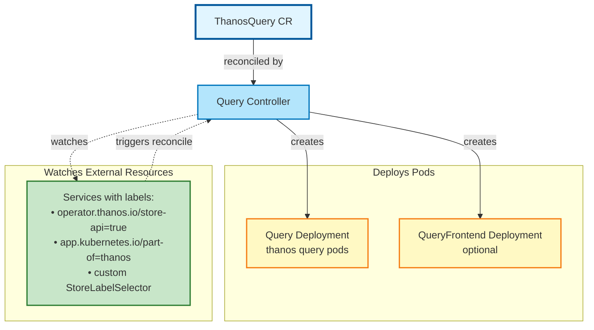
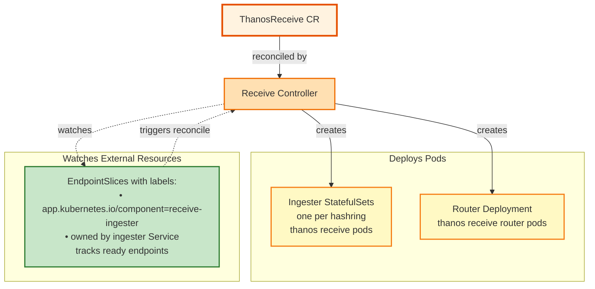
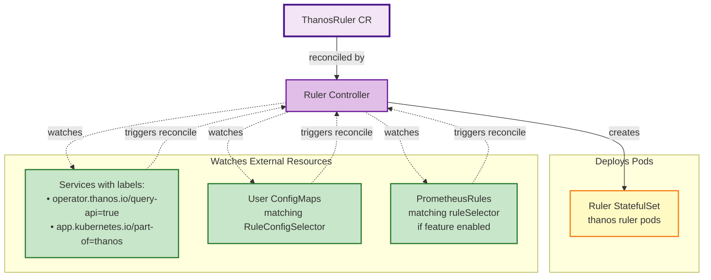
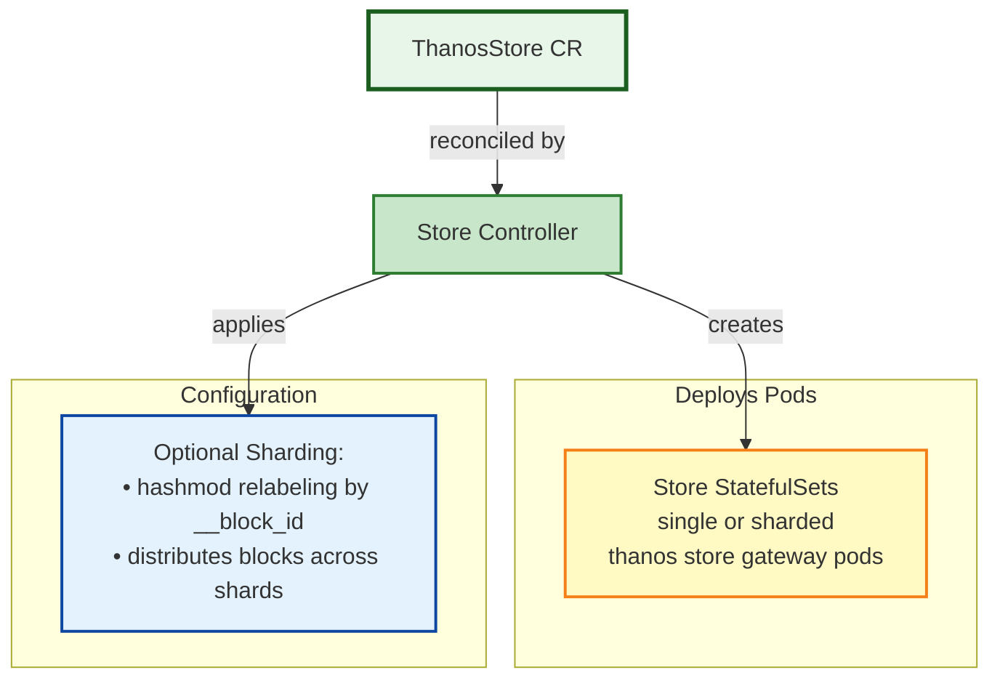
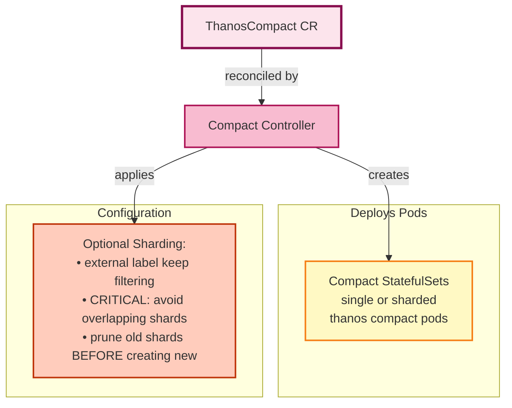

# Thanos Operator Alerts Runbook

## Table of Contents

- [Thanos Operator Alerts Runbook](#thanos-operator-alerts-runbook)
  - [Table of Contents](#table-of-contents)

### General Operator

- [ThanosOperatorDown](#thanosoperatordown)
- [ThanosOperatorHighReconcileErrorRate](#thanosoperatorhighreconcileerrorrate)
- [ThanosOperatorReconcileStuck](#thanosoperatorreconcilestuck)
- [ThanosOperatorWorkQueueGrowth](#thanosoperatorworkqueuegrowth)
- [ThanosOperatorSlowReconciliation](#thanosoperatorslowreconciliation)
- [ThanosOperatorHighWorkqueueRetries](#thanosoperatorhighworkqueueretries)
- [ThanosOperatorLongWorkqueueLatency](#thanosoperatorlongworkqueuelatency)

### Thanos Query Resource

- [ThanosQueryNoEndpointsConfigured](#thanosquerynoendpointsconfigured)
- [ThanosQueryServiceWatchReconcileStorm](#thanosqueryservicewatchreconcilestorm)

### Thanos Receive Resource

- [ThanosReceiveNoHashringsConfigured](#thanosreceivenohashringsconfigured)
- [ThanosReceiveHashringNoEndpoints](#thanosreceivehashringnoendpoints)
- [ThanosReceiveHashringConfigurationChange](#thanosreceivehashringconfigurationchange)
- [ThanosReceiveEndpointReconcileStorm](#thanosreceiveendpointreconcilestorm)

### Thanos Ruler Resource

- [ThanosRulerNoQueryEndpointsConfigured](#thanosrulernoqueryendpointsconfigured)
- [ThanosRulerNoPrometheusRulesConfigured](#thanosrulernoprometheusrulesconfigured)
- [ThanosRulerNoRulesConfigured](#thanosrulernorulesconfigured)
- [ThanosRulerConfigMapCreationFailures](#thanosrulerconfigmapcreationfailures)
- [ThanosRulerHighConfigMapCreationRate](#thanosrulerhighconfigmapcreationrate)
- [ThanosRulerWatchReconcileStorm](#thanosrulerwatchreconcilestorm)

### Thanos Store Resource

- [ThanosStoreNoShardsConfigured](#thanosstorenoshardsconfigured)
- [ThanosStoreShardCreationFailures](#thanosstoreshardcreationfailures)

### Thanos Compact Resource

- [ThanosCompactNoShardsConfigured](#thanoscompactnoshardsconfigured)
- [ThanosCompactShardCreationFailures](#thanoscompactshardcreationfailures)

### Resource Lifecycle

- [ThanosResourcePausedForLong](#thanosresourcepausedforlong)

---

## Environment & Access Information

### Multi-Cluster Environment

This operator runs across multiple private Kubernetes clusters. To troubleshoot alerts:

- **Identify the cluster** from the alert labels (typically `cluster` or `prometheus` label)
- **Access Grafana for metrics:**
   - Navigate to Thanos Operator dashboard (linked in alert) or use Explore view for PromQL queries
   - URL: `https://grafana.app-sre.devshift.net/?orgId=1`
   - Select datasource: `<cluster>-prometheus` (e.g., `rhobsp02ue1-prometheus`)
- **Access the cluster (for kubectl commands):**
   - Visit the cluster page: `https://visual-app-interface.devshift.net/clusters/<cluster-name>`
   - Follow the sshuttle access instructions provided on the cluster page
   - For `kubectl` access, navigate to `https://oauth-openshift.apps.<cluster_name>.openshiftapps.com/oauth/token/request` (find the cluster name from the console URL on the cluster page in the visual app interface), copy the `oc login` command shown there, and run it — this grants `kubectl` access to the cluster
- **View Configuration:**
   - Configuration repository: `https://gitlab.cee.redhat.com/rhobs/configuration/-/tree/main/resources/clusters/production/<cluster>/metrics/bundle`
   - Contains ThanosOperator and all Thanos CRs (ThanosQuery, ThanosReceive, ThanosRuler, ThanosStore, ThanosCompact)

### Prometheus Query Access

For all PromQL metric queries in this runbook:
- **Preferred Method:** Use **Grafana** at `https://grafana.app-sre.devshift.net/?orgId=1`
  - Select the `<cluster>-prometheus` datasource (e.g., `rhobsp01ue1-prometheus`)
  - Use the Thanos Operator dashboard for pre-built visualizations
  - Copy-paste PromQL queries from investigative steps for ad-hoc exploration
- **Alternative:** Access Prometheus UI directly via sshuttle tunnel after cluster access
- **Query Placeholders:**
  - Replace `<cluster>` with actual cluster name from alert labels
  - Replace `<resource-name>` with the actual CR name (e.g. `rhobs` for all Thanos CRs — ThanosQuery, ThanosReceive, ThanosRuler, ThanosStore, ThanosCompact)
  - Namespace is `rhobs-production` across all clusters (already filled in throughout this runbook)

---

## Operator Architecture Overview

### ThanosQuery Controller



**Key Points:**
- Discovers StoreAPI endpoints from labeled Services
- Creates Query pods that federate data from Store/Receive/Ruler
- Optional QueryFrontend for caching and query splitting
- Watch triggers: Service label/generation changes

---

### ThanosReceive Controller



**Key Points:**
- Creates StatefulSets for ingesters (one per hashring)
- Router Deployment distributes incoming remote write traffic
- Hashring ConfigMap generated from ready ingester endpoints
- Watch triggers: EndpointSlice ready state changes (pod readiness)

---

### ThanosRuler Controller



**Key Points:**
- Discovers QueryAPI endpoints for rule evaluation
- Loads rules from ConfigMaps and/or PrometheusRule CRs
- Generates bucketed rule ConfigMaps (avoid 1MB limit)
- Watch triggers: Service changes, ConfigMap updates, PrometheusRule modifications

---

### ThanosStore Controller



**Key Points:**
- No external watches (only reconciles on CR changes)
- Creates StatefulSet(s) for Store Gateway pods
- Optional sharding via external label hashmod filtering
- Sharding distributes blocks from object storage across shards

---

### ThanosCompact Controller



**Key Points:**
- No external watches (only reconciles on CR changes)
- Creates StatefulSet(s) for Compactor pods
- ⚠️ **CRITICAL:** Single compactor per bucket recommended
- Sharding uses external label filtering (must not overlap)
- Prune-first strategy prevents concurrent compactors

---

## ThanosOperatorDown

**Severity:** `warning` | **For:** 5m | **Component:** Thanos Operator

**Summary:**
The Thanos Operator has been down for more than 5 minutes. No reconciliation is happening. Thanos resources are not being reconciled and configuration changes will not be applied.

**Impact:**
Desired state in Thanos CRs is not applied to the cluster; configuration drift and stale workloads persist until the operator is healthy again.

**Alert Expression:**
```promql
up{job="thanos-operator-controller-manager-metrics-service"} == 0
```

**Steps:**
- Check if the operator pod is running:
  ```bash
  kubectl get pods -n rhobs-production -l control-plane=controller-manager
  ```
- If the pod is missing, check the deployment:
  ```bash
  kubectl get deployment -n rhobs-production thanos-operator-controller-manager
  ```
- Check pod events for crash/restart reasons:
  ```bash
  kubectl describe pod -n rhobs-production <operator-pod>
  ```
- Review operator logs for startup errors:
  ```bash
  kubectl logs -n rhobs-production <operator-pod> --tail=100
  ```
- Common issues include image pull failures, resource constraints (OOMKilled), RBAC permission issues, CRD installation problems, and webhook failures.
- Verify RBAC permissions for key operations:
  ```bash
  # Check if operator can manage Thanos resources
  kubectl auth can-i --as=system:serviceaccount:rhobs-production:thanos-operator-controller-manager create thanosquery
  kubectl auth can-i --as=system:serviceaccount:rhobs-production:thanos-operator-controller-manager create statefulset
  kubectl auth can-i --as=system:serviceaccount:rhobs-production:thanos-operator-controller-manager create configmap
  kubectl auth can-i --as=system:serviceaccount:rhobs-production:thanos-operator-controller-manager create service
  ```
- Verify CRDs are installed:
  ```bash
  kubectl get crd | grep thanos.io
  ```
- Check operator metrics in Prometheus:
  ```promql
  up{job="thanos-operator"}
  process_start_time_seconds{job="thanos-operator"}
  ```
- Restart the operator if necessary:
  ```bash
  kubectl rollout restart deployment -n rhobs-production thanos-operator-controller-manager
  ```

**Access Required:**
- **Grafana:** `https://grafana.app-sre.devshift.net/?orgId=1` - Select `<cluster>-prometheus` datasource
- Cluster access via sshuttle (see [Environment & Access Information](#environment--access-information))
- **Configuration:** `https://gitlab.cee.redhat.com/rhobs/configuration/-/tree/main/resources/clusters/production/<cluster>/metrics/bundle`
- Permission to view/restart operator deployment and RBAC configuration

---

## ThanosOperatorHighReconcileErrorRate

**Severity:** `warning` | **For:** 10m | **Component:** Thanos Operator

**Summary:**
The controller has a high reconciliation error rate (>10%) over the last 10 minutes. Resources managed by this controller may not be correctly configured or updated.

**Impact:**
Affected resources can remain misconfigured or stuck; errors may hide which CR is the root cause until logs are reviewed.

**Alert Expression:**
```promql
sum by (controller) (
  rate(controller_runtime_reconcile_errors_total{job="thanos-operator-controller-manager-metrics-service"}[2m])
)
/
sum by (controller) (
  rate(controller_runtime_reconcile_total{job="thanos-operator-controller-manager-metrics-service"}[2m])
)
> 0.1
```

**Steps:**
- Identify which controller is affected from alert labels (thanosquery, thanosreceive, thanosruler, thanosstore, thanoscompact).
- Check operator logs for reconciliation errors with resource details:
  ```bash
  kubectl logs -n rhobs-production -l control-plane=controller-manager --tail=200 | grep -E "error|failed to create or update"
  ```
- Identify the specific resource causing errors by checking status conditions:
  ```bash
  kubectl get <thanos-resource> --all-namespaces -o json | jq '.items[] | select(.status.conditions[]? | select(.type=="ReconcileFailed"))'
  ```
- Common error causes:
  - **Resource creation failures:** Check for "failed to create or update" in logs with resource kind and name
  - **Owner reference errors:** "failed to set controller owner reference" indicates RBAC or scheme issues
  - **List errors:** "failed to list" indicates missing RBAC read permissions
  - **Invalid specs:** API validation errors during CreateOrUpdate
  - **Resource quotas:** Check quotas if StatefulSet/Deployment creation fails
- Check the problematic resource spec and status:
  ```bash
  kubectl get <resource-type> -n rhobs-production <resource-name> -o yaml
  ```
- Review resource status conditions for specific error messages:
  ```bash
  kubectl get <resource-type> -n rhobs-production <resource-name> -o jsonpath='{.status.conditions[?(@.type=="ReconcileFailed")].message}'
  ```
- Check controller metrics for error rate in Prometheus:
  ```promql
  rate(controller_runtime_reconcile_errors_total{controller=~"thanosquery|thanosreceive|thanosruler|thanosstore|thanoscompact"}[5m])
  ```
- Fix configuration errors based on the specific error message.
- Monitor reconciliation metrics after the fix to confirm error rate decreases.

**Access Required:**
- **Grafana:** `https://grafana.app-sre.devshift.net/?orgId=1` - Select `<cluster>-prometheus` datasource
- Cluster access via sshuttle (see [Environment & Access Information](#environment--access-information))
- **Configuration:** `https://gitlab.cee.redhat.com/rhobs/configuration/-/tree/main/resources/clusters/production/<cluster>/metrics/bundle`
- Permission to view operator logs and modify Thanos CRs

---

## ThanosOperatorReconcileStuck

**Severity:** `warning` | **For:** 15m | **Component:** Thanos Operator

**Summary:**
The workqueue has items but no reconciliations are happening. The controller appears stuck. Changes to Thanos resources are not being processed.

**Impact:**
Queued updates are not applied; operational fixes may appear to have no effect until reconciliation resumes.

**Alert Expression:**
```promql
rate(
  controller_runtime_reconcile_total{job="thanos-operator-controller-manager-metrics-service"}[10m]
)
== 0
and on (controller, job)
  workqueue_depth{job="thanos-operator-controller-manager-metrics-service"} > 0
```

**Steps:**
- Check operator health and readiness:
  ```bash
  kubectl get pods -n rhobs-production -l control-plane=controller-manager
  kubectl logs -n rhobs-production <operator-pod> --tail=50
  ```
- Check workqueue depth and reconciliation metrics in Prometheus:
  ```promql
  workqueue_depth{name=~"thanosquery|thanosreceive|thanosruler|thanosstore|thanoscompact"}
  rate(workqueue_adds_total{name=~"thanosquery|thanosreceive|thanosruler|thanosstore|thanoscompact"}[5m])
  rate(controller_runtime_reconcile_total{controller=~"thanosquery|thanosreceive|thanosruler|thanosstore|thanoscompact"}[5m])
  ```
- If workqueue has items (`workqueue_depth > 0`) but no recent reconciliations (`controller_runtime_reconcile_total` not increasing):
  - Check if operator is paused or leader election lost
  - Check for goroutine deadlock (CPU usage should be low if stuck)
- Common causes:
  - **API server connectivity:** Controller-runtime cannot list/watch resources
  - **Watch failures:** Informer cache not syncing, check for "failed to list" errors
  - **Panic in reconciliation:** Check for panic stack traces in logs
  - **Resource contention:** Operator pod CPU/memory throttled
- Check API server connectivity and latency:
  ```bash
  kubectl get --raw /healthz
  ```
  Query Prometheus for API client latency:
  ```promql
  histogram_quantile(0.99, rate(rest_client_request_duration_seconds_bucket{job="thanos-operator"}[5m]))
  ```
- Review recent resource changes and controller leader status:
  ```bash
  kubectl get events -n rhobs-production --sort-by='.lastTimestamp' | tail -20
  kubectl get lease -n rhobs-production
  ```
- Restart the operator to clear stuck state:
  ```bash
  kubectl delete pod -n rhobs-production <operator-pod>
  ```
- After restart, confirm reconciliation resumes by checking metrics in Prometheus:
  ```promql
  rate(controller_runtime_reconcile_total{controller=~"thanosquery|thanosreceive|thanosruler|thanosstore|thanoscompact"}[5m])
  ```

**Access Required:**
- **Grafana:** `https://grafana.app-sre.devshift.net/?orgId=1` - Select `<cluster>-prometheus` datasource
- Cluster access via sshuttle (see [Environment & Access Information](#environment--access-information))
- **Configuration:** `https://gitlab.cee.redhat.com/rhobs/configuration/-/tree/main/resources/clusters/production/<cluster>/metrics/bundle`
- Permission to restart operator pods

---

## ThanosOperatorWorkQueueGrowth

**Severity:** `warning` | **For:** 15m | **Component:** Thanos Operator

**Summary:**
Workqueue depth is greater than 100, indicating the controller cannot keep up with events. Reconciliation is falling behind and configuration updates may be delayed.

**Impact:**
Lag grows between desired configuration and the live cluster; changes take longer to apply and may batch unpredictably.

**Alert Expression:**
```promql
last_over_time(workqueue_depth{job="thanos-operator-controller-manager-metrics-service"}[5m]) > 100
```

**Steps:**
- Check current queue depth per controller in Prometheus:
  ```promql
  workqueue_depth{name=~"thanosquery|thanosreceive|thanosruler|thanosstore|thanoscompact"}
  ```
- Identify which controller has the growing queue (thanosquery, thanosreceive, thanosruler, thanosstore, thanoscompact).
- Check reconciliation performance metrics in Prometheus:
  ```promql
  # Reconciliation duration P99 (should be < 60s)
  histogram_quantile(0.99, rate(controller_runtime_reconcile_time_seconds_bucket{controller=~"thanosquery|thanosreceive|thanosruler|thanosstore|thanoscompact"}[5m]))
  
  # Reconciliation rate
  rate(controller_runtime_reconcile_total{controller=~"thanosquery|thanosreceive|thanosruler|thanosstore|thanoscompact"}[5m])
  ```
- Common causes:
  - **Too many resources:** Count Thanos CRs across all namespaces
  - **Watch storms:** Service/ConfigMap/EndpointSlice changes triggering frequent reconciliations (check `*_event_reconciliations_total` metrics)
  - **Slow resource creation:** Large StatefulSets with many replicas take time to create
  - **API server throttling:** Check `rest_client_request_duration_seconds` for high latency
- Check operator resource usage and limits:
  ```bash
  kubectl top pod -n rhobs-production <operator-pod>
  kubectl describe pod -n rhobs-production <operator-pod> | grep -A 5 Limits
  ```
- Check for reconciliation loops (watch-triggered reconciliations) in Prometheus:
  ```promql
  rate(thanos_operator_query_service_event_reconciliations_total[5m])
  rate(thanos_operator_receive_endpoint_event_reconciliations_total[5m])
  rate(thanos_operator_ruler_service_event_reconciliations_total[5m])
  rate(thanos_operator_ruler_cfgmap_event_reconciliations_total[5m])
  rate(thanos_operator_ruler_promrule_event_reconciliations_total[5m])
  ```
- If watch storms detected: investigate why Services/Endpoints/ConfigMaps are changing frequently.
- Consider mitigation:
  - Increase operator CPU/memory limits
  - Reduce unnecessary watch triggers (stabilize underlying resources)
  - Check if resources are being updated unnecessarily (e.g., by other controllers)

**Access Required:**
- **Grafana:** `https://grafana.app-sre.devshift.net/?orgId=1` - Select `<cluster>-prometheus` datasource
- Cluster access via sshuttle (see [Environment & Access Information](#environment--access-information))
- **Configuration:** `https://gitlab.cee.redhat.com/rhobs/configuration/-/tree/main/resources/clusters/production/<cluster>/metrics/bundle`
- Permission to modify operator deployment

---

## ThanosOperatorSlowReconciliation

**Severity:** `warning` | **For:** 10m | **Component:** Thanos Operator

**Summary:**
P99 reconciliation time is greater than 60 seconds. Configuration changes are taking longer than expected to apply.

**Impact:**
Operators and users wait longer to see spec changes reflected; windows where desired and actual state diverge last longer.

**Alert Expression:**
```promql
histogram_quantile(
  0.99,
  rate(
    controller_runtime_reconcile_time_seconds_bucket{job="thanos-operator-controller-manager-metrics-service"}[10m]
  )
)
> 60
```

**Steps:**
- Check reconciliation latency by controller in Prometheus:
  ```promql
  histogram_quantile(0.99, rate(controller_runtime_reconcile_time_seconds_bucket{controller=~"thanosquery|thanosreceive|thanosruler|thanosstore|thanoscompact"}[5m]))
  ```
- Identify which controller has high P99 latency (look for `quantile="0.99"` buckets).
- Review operator logs for slow operations:
  ```bash
  kubectl logs -n rhobs-production <operator-pod> --tail=200 | grep -E "slow|took|duration"
  ```
- Common slow operations by controller:
  - **ThanosQuery:** Service discovery across many namespaces, large number of StoreAPI endpoints
  - **ThanosReceive:** EndpointSlice querying for many hashrings, hashring ConfigMap generation
  - **ThanosRuler:** PrometheusRule discovery, large rule ConfigMap creation, YAML parsing of many rules
  - **ThanosStore/Compact:** StatefulSet creation with many shards, PVC creation delays
- Check API server latency and throttling in Prometheus:
  ```promql
  # API request latency by verb
  histogram_quantile(0.99, rate(rest_client_request_duration_seconds_bucket{job="thanos-operator",verb="GET"}[5m]))
  
  # Rate limiter wait time
  histogram_quantile(0.99, rate(rest_client_rate_limiter_duration_seconds_bucket{job="thanos-operator"}[5m]))
  ```
- Check operator resource usage and throttling:
  ```bash
  kubectl top pod -n rhobs-production <operator-pod>
  kubectl describe pod -n rhobs-production <operator-pod> | grep -E "Limits|Requests|State"
  ```
- For specific slow controllers:
  - **Query:** Reduce number of namespaces watched or optimize label selectors
  - **Receive:** Check if EndpointSlices are large or numerous
  - **Ruler:** Check if PrometheusRules have many groups or complex expressions
- Optimize by increasing operator CPU limits, reducing resource count, or improving API server performance.

**Access Required:**
- **Grafana:** `https://grafana.app-sre.devshift.net/?orgId=1` - Select `<cluster>-prometheus` datasource
- Cluster access via sshuttle (see [Environment & Access Information](#environment--access-information))
- **Configuration:** `https://gitlab.cee.redhat.com/rhobs/configuration/-/tree/main/resources/clusters/production/<cluster>/metrics/bundle`
- Permission to modify operator resources

---

## ThanosOperatorHighWorkqueueRetries

**Severity:** `warning` | **For:** 15m | **Component:** Thanos Operator

**Summary:**
The workqueue has more than 0.5 retries/second. Items are being retried frequently, indicating persistent errors or resource issues.

**Impact:**
Repeated failures delay successful reconciliation and can increase API load until the underlying issue is fixed.

**Alert Expression:**
```promql
rate(workqueue_retries_total{job="thanos-operator-controller-manager-metrics-service"}[10m]) > 0.5
```

**Steps:**
- Check retry metrics per controller in Prometheus:
  ```promql
  rate(workqueue_retries_total{name=~"thanosquery|thanosreceive|thanosruler|thanosstore|thanoscompact"}[5m])
  ```
- Review operator logs for reconciliation errors causing retries:
  ```bash
  kubectl logs -n rhobs-production <operator-pod> --tail=200 | grep -E "error|Reconciler error"
  ```
- Common retry causes:
  - **API server transient errors:** Check `rest_client_request_duration_seconds` for high latency or timeouts
  - **Resource conflicts:** "object has been modified" errors during CreateOrUpdate
  - **Ownership conflicts:** Child resources owned by different controller
  - **Validation failures:** Invalid resource spec rejected by API server
  - **Missing dependencies:** ConfigMaps, Secrets, or Services not found
- Identify which Thanos resources are failing by checking status conditions:
  ```bash
  kubectl get thanosquery,thanosreceive,thanosruler,thanosstore,thanoscompact --all-namespaces -o json | jq '.items[] | select(.status.conditions[]? | select(.type=="ReconcileFailed")) | {name: .metadata.name, namespace: .metadata.namespace, message: .status.conditions[] | select(.type=="ReconcileFailed") | .message}'
  ```
- Check for specific error patterns in logs:
  - "failed to create or update" - resource creation issue
  - "failed to list" - RBAC read permission missing
  - "failed to set controller owner reference" - ownership conflict
- Review resource states and child resources:
  ```bash
  kubectl get <resource-type> -n rhobs-production <resource-name> -o yaml
  kubectl get statefulset,deployment,configmap,service -n rhobs-production -l app.kubernetes.io/instance=<resource-name>
  ```
- Fix underlying issues based on specific error patterns.
- Monitor retry rate and error conditions after fixes in Prometheus:
  ```promql
  rate(workqueue_retries_total{name=~"thanosquery|thanosreceive|thanosruler|thanosstore|thanoscompact"}[5m])
  ```

**Access Required:**
- **Grafana:** `https://grafana.app-sre.devshift.net/?orgId=1` - Select `<cluster>-prometheus` datasource
- Cluster access via sshuttle (see [Environment & Access Information](#environment--access-information))
- **Configuration:** `https://gitlab.cee.redhat.com/rhobs/configuration/-/tree/main/resources/clusters/production/<cluster>/metrics/bundle`
- Permission to view operator logs and modify resources

---

## ThanosOperatorLongWorkqueueLatency

**Severity:** `warning` | **For:** 10m | **Component:** Thanos Operator

**Summary:**
P99 queue wait time is greater than 60 seconds. Items are waiting too long in the queue before processing. Reconciliation is delayed.

**Impact:**
Events are handled late; urgent configuration changes and incident remediation are slowed.

**Alert Expression:**
```promql
histogram_quantile(
  0.99,
  rate(
    workqueue_queue_duration_seconds_bucket{job="thanos-operator-controller-manager-metrics-service"}[10m]
  )
)
> 60
```

**Steps:**
- Check queue wait time (P99 latency) per controller in Prometheus:
  ```promql
  histogram_quantile(0.99, rate(workqueue_queue_duration_seconds_bucket{name=~"thanosquery|thanosreceive|thanosruler|thanosstore|thanoscompact"}[5m]))
  ```
- Review queue depth to understand backlog in Prometheus:
  ```promql
  workqueue_depth{name=~"thanosquery|thanosreceive|thanosruler|thanosstore|thanoscompact"}
  ```
- Check reconciliation throughput (items processed per second) in Prometheus:
  ```promql
  rate(controller_runtime_reconcile_total{controller=~"thanosquery|thanosreceive|thanosruler|thanosstore|thanoscompact"}[5m])
  ```
- Common causes:
  - **High queue depth:** Too many items waiting (> 100), see ThanosOperatorWorkQueueGrowth
  - **Slow reconciliation:** P99 reconciliation time > 60s, see ThanosOperatorSlowReconciliation
  - **Operator resource constraints:** CPU throttling or memory pressure
  - **Watch event storms:** Rapid Service/ConfigMap/EndpointSlice changes
- Check operator resource usage and throttling:
  ```bash
  kubectl top pod -n rhobs-production <operator-pod>
  kubectl describe pod -n rhobs-production <operator-pod> | grep -A 10 "Limits\|State"
  ```
- Identify event sources causing queue backlog in Prometheus:
  ```promql
  # Check watch-triggered reconciliation rates
  rate(thanos_operator_query_service_event_reconciliations_total[5m])
  rate(thanos_operator_receive_endpoint_event_reconciliations_total[5m])
  rate(thanos_operator_ruler_service_event_reconciliations_total[5m])
  rate(thanos_operator_ruler_cfgmap_event_reconciliations_total[5m])
  rate(thanos_operator_ruler_promrule_event_reconciliations_total[5m])
  ```
- Review recent events to find churn:
  ```bash
  kubectl get events --all-namespaces --sort-by='.lastTimestamp' | grep -E "Service|ConfigMap|EndpointSlice" | tail -50
  ```
- Optimize by:
  - Increasing operator CPU/memory limits if resource-constrained
  - Stabilizing underlying resources to reduce watch events
  - Reducing number of Thanos CRs if queue depth is chronically high

**Access Required:**
- **Grafana:** `https://grafana.app-sre.devshift.net/?orgId=1` - Select `<cluster>-prometheus` datasource
- Cluster access via sshuttle (see [Environment & Access Information](#environment--access-information))
- **Configuration:** `https://gitlab.cee.redhat.com/rhobs/configuration/-/tree/main/resources/clusters/production/<cluster>/metrics/bundle`
- Permission to modify operator deployment

---

## ThanosQueryNoEndpointsConfigured

**Severity:** `warning` | **For:** 10m | **Component:** Thanos Query

**Summary:**
The ThanosQuery resource has no store endpoints configured. The query component cannot retrieve data from any stores. Queries will return no results.

**Impact:**
Users querying this Thanos Query see empty or missing series for store-backed data until endpoints are configured.

**Alert Expression:**
```promql
thanos_operator_query_endpoints_configured{job="thanos-operator-controller-manager-metrics-service"} == 0
```

**Steps:**
- Check the ThanosQuery custom resource and current endpoint count:
  ```bash
  kubectl get thanosquery -n rhobs-production <query-name> -o yaml
  ```
- Check the endpoint discovery metric in Prometheus:
  ```promql
  thanos_operator_query_endpoints_configured{resource="<query-name>"}
  ```
- Verify store endpoints configuration in spec:
  ```yaml
  spec:
    storeLabelSelector:
      matchLabels:
        # Custom labels for service discovery
  ```
- **Key discovery mechanism:** ThanosQuery discovers StoreAPI endpoints by watching Services with:
  - Label: `operator.thanos.io/store-api: "true"` (required)
  - Label: `app.kubernetes.io/part-of: thanos` (required)
  - Additional labels from `spec.storeLabelSelector` (optional)
  - Port named `grpc` or with protocol `TCP` and port `10901`
- Check if StoreAPI services exist with correct labels:
  ```bash
  kubectl get svc --all-namespaces -l operator.thanos.io/store-api=true,app.kubernetes.io/part-of=thanos
  ```
- Verify services have the required gRPC port:
  ```bash
  kubectl get svc -n <store-namespace> <store-service> -o jsonpath='{.spec.ports[?(@.name=="grpc")]}'
  ```
- Common issues:
  - **Missing labels:** Services missing `operator.thanos.io/store-api: true` or `app.kubernetes.io/part-of: thanos`
  - **Wrong namespace:** Query controller may only watch specific namespaces
  - **Port mismatch:** Service port not named `grpc` or not on expected port
  - **No Store resources:** ThanosStore CRs not created or not creating services
- Check operator logs for service discovery:
  ```bash
  kubectl logs -n rhobs-production <operator-pod> --tail=100 | grep -E "NoEndpointsFound|store.*endpoint|service.*discovered"
  ```
- Add correct labels to Store services:
  ```bash
  kubectl label svc -n <store-namespace> <store-service> operator.thanos.io/store-api=true app.kubernetes.io/part-of=thanos
  ```
- Verify Store resources and their services:
  ```bash
  kubectl get thanosstore --all-namespaces
  kubectl get svc -l app.kubernetes.io/instance=<store-name> -o wide
  ```

**Access Required:**
- **Grafana:** `https://grafana.app-sre.devshift.net/?orgId=1` - Select `<cluster>-prometheus` datasource
- Cluster access via sshuttle (see [Environment & Access Information](#environment--access-information))
- **Configuration:** `https://gitlab.cee.redhat.com/rhobs/configuration/-/tree/main/resources/clusters/production/<cluster>/metrics/bundle`
- Permission to view/modify ThanosQuery CRs and access operator logs

---

## ThanosQueryServiceWatchReconcileStorm

**Severity:** `warning` | **For:** 10m | **Component:** Thanos Query

**Summary:**
ThanosQuery is reconciling more than 2 times/second due to service events. Excessive reconciliations may indicate service churn or configuration issues.

**Impact:**
Unnecessary operator load and possible delayed reconciliation; often correlates with unstable Services or endpoints behind the query.

**Alert Expression:**
```promql
rate(
  thanos_operator_query_service_event_reconciliations_total{job="thanos-operator-controller-manager-metrics-service"}[5m]
)
> 2
```

**Steps:**
- Check service watch reconciliation rate in Prometheus:
  ```promql
  rate(thanos_operator_query_service_event_reconciliations_total{resource="<query-name>"}[5m])
  ```
- Review operator logs for service watch events:
  ```bash
  kubectl logs -n rhobs-production <operator-pod> --tail=200 | grep -E "service.*watch|service.*reconcile|ThanosQuery.*Reconcile"
  ```
- Identify which services are triggering reconciliations (StoreAPI services with labels):
  ```bash
  kubectl get events --all-namespaces --field-selector involvedObject.kind=Service --sort-by='.lastTimestamp' | grep -E "operator.thanos.io/store-api|app.kubernetes.io/part-of=thanos" | tail -30
  ```
- Check service stability for StoreAPI services:
  ```bash
  kubectl get svc --all-namespaces -l operator.thanos.io/store-api=true,app.kubernetes.io/part-of=thanos --watch
  ```
- Common causes:
  - **Store pod restarts:** Check pods behind StoreAPI services for crashloops
  - **Service label changes:** External controllers modifying service labels
  - **Load balancer updates:** External IP or load balancer status changes triggering Service updates
  - **Service selector changes:** Deployment rollouts changing selector labels
  - **Service generation churn:** Annotations or specs being updated frequently
- Review pod stability for Store services:
  ```bash
  kubectl get pods -l app.kubernetes.io/component=store --all-namespaces --watch
  ```
- Investigate root cause of service churn:
  ```bash
  # Check for pod crashloops
  kubectl get pods -l app.kubernetes.io/component=store --all-namespaces -o json | jq '.items[] | select(.status.containerStatuses[]?.restartCount > 5) | {name: .metadata.name, namespace: .metadata.namespace, restarts: .status.containerStatuses[].restartCount}'
  
  # Check for recent deployments or rollouts
  kubectl get events --all-namespaces --sort-by='.lastTimestamp' | grep -E "Deployment|StatefulSet" | tail -20
  ```
- Stabilize underlying resources:
  - Fix pod crashloops (resource limits, liveness probes, storage issues)
  - Reduce deployment churn (avoid unnecessary rollouts)
  - Prevent label changes (review automation or controllers)

**Access Required:**
- **Grafana:** `https://grafana.app-sre.devshift.net/?orgId=1` - Select `<cluster>-prometheus` datasource
- Cluster access via sshuttle (see [Environment & Access Information](#environment--access-information))
- **Configuration:** `https://gitlab.cee.redhat.com/rhobs/configuration/-/tree/main/resources/clusters/production/<cluster>/metrics/bundle`
- Permission to view events, operator logs, and investigate resources

---

## ThanosReceiveNoHashringsConfigured

**Severity:** `warning` | **For:** 10m | **Component:** Thanos Receive

**Summary:**
The ThanosReceive resource has no hashrings configured. The receive component cannot accept remote write data without hashring configuration.

**Impact:**
Remote write traffic cannot be routed correctly; ingestion for this receive stack is effectively blocked until hashrings exist.

**Alert Expression:**
```promql
thanos_operator_receive_hashrings_configured{job="thanos-operator-controller-manager-metrics-service"} == 0
```

**Steps:**
- Check the ThanosReceive custom resource and hashring count:
  ```bash
  kubectl get thanosreceive -n rhobs-production <receive-name> -o yaml
  ```
- Check hashring metrics in Prometheus:
  ```promql
  thanos_operator_receive_hashrings_configured{resource="<receive-name>"}
  ```
- Verify hashring configuration in spec:
  ```yaml
  spec:
    hashrings:
      - name: default
        tenants: ["*"]
  ```
- If no hashrings defined, add default configuration:
  ```yaml
  spec:
    hashrings:
      - name: default
        tenants: ["*"]
        externalLabels:
          receive: "true"
          replica: "$(HOSTNAME)"
  ```
- Review ThanosReceive status for hashring state:
  ```bash
  kubectl get thanosreceive -n rhobs-production <receive-name> -o jsonpath='{.status.hashringStatus}'
  ```
- Verify the hashring ConfigMap is created and mounted to router:
  ```bash
  kubectl get configmap -n rhobs-production -l app.kubernetes.io/instance=<receive-name> | grep hashring
  kubectl describe deployment -n rhobs-production <receive-name>-router | grep -A 5 "Mounts:"
  ```
- Check operator logs for hashring generation:
  ```bash
  kubectl logs -n rhobs-production <operator-pod> --tail=100 | grep -E "hashring|ThanosReceive.*Reconcile"
  ```
- Verify router picks up the configuration:
  ```bash
  # Check router logs for hashring config reload
  kubectl logs -n rhobs-production -l app.kubernetes.io/component=receive-router --tail=50 | grep -E "hashring|config|reload"
  
  # Check router ConfigMap volume mount
  kubectl exec -n rhobs-production <router-pod> -- cat /etc/thanos/hashring/hashring.json
  ```

**Access Required:**
- **Grafana:** `https://grafana.app-sre.devshift.net/?orgId=1` - Select `<cluster>-prometheus` datasource
- Cluster access via sshuttle (see [Environment & Access Information](#environment--access-information))
- **Configuration:** `https://gitlab.cee.redhat.com/rhobs/configuration/-/tree/main/resources/clusters/production/<cluster>/metrics/bundle`
- Permission to modify ThanosReceive CRs, ConfigMaps, and access operator logs

---

## ThanosReceiveHashringNoEndpoints

**Severity:** `warning` | **For:** 10m | **Component:** Thanos Receive

**Summary:**
A hashring has no endpoints configured. Data cannot be distributed to this hashring. Remote write data may be lost or rejected.

**Impact:**
Ingestion for that hashring can fail or drop data until ingester endpoints are healthy and selected correctly.

**Alert Expression:**
```promql
thanos_operator_receive_hashring_endpoints_configured{job="thanos-operator-controller-manager-metrics-service"} == 0
```

**Steps:**
- **Treat as high data-loss risk until resolved.**
- Check hashring endpoint metrics in Prometheus:
  ```promql
  thanos_operator_receive_hashring_endpoints_configured{resource="<receive-name>"}
  ```
- Identify which hashring has zero endpoints (check metric labels).
- Verify ingester StatefulSets and pods for the affected hashring:
  ```bash
  # List all receive ingester StatefulSets
  kubectl get statefulset -n rhobs-production -l app.kubernetes.io/instance=<receive-name>,app.kubernetes.io/component=receive-ingester
  
  # Check pods for specific hashring
  kubectl get pods -n rhobs-production -l app.kubernetes.io/instance=<receive-name>,operator.thanos.io/hashring=<hashring-name>
  ```
- **Key discovery mechanism:** Operator queries EndpointSlices owned by ingester Services to find ready endpoints.
- Check EndpointSlices for the hashring:
  ```bash
  kubectl get endpointslices -n rhobs-production -l app.kubernetes.io/instance=<receive-name>,operator.thanos.io/hashring=<hashring-name>
  kubectl get endpointslices -n rhobs-production <endpointslice-name> -o jsonpath='{.endpoints[*].conditions.ready}'
  ```
- Common issues:
  - **No ingester pods:** StatefulSet not created or replicas=0
  - **Pods not ready:** Failing readiness probes (check pod conditions and logs)
  - **Service selector mismatch:** Service not selecting ingester pods correctly
  - **EndpointSlice not created:** Service or EndpointSlice controller issue
- Check StatefulSet status and replica count:
  ```bash
  kubectl get statefulset -n rhobs-production <receive-name>-<hashring-name>-ingester -o jsonpath='{.spec.replicas} {.status.readyReplicas}'
  ```
- Verify ingester pod health:
  ```bash
  kubectl get pods -n rhobs-production -l operator.thanos.io/hashring=<hashring-name> -o wide
  kubectl describe pod -n rhobs-production <ingester-pod> | grep -A 10 "Conditions:\|Events:"
  ```
- Check ingester logs for startup errors:
  ```bash
  kubectl logs -n rhobs-production <ingester-pod> --tail=50
  ```
- If StatefulSet missing or scaled to 0, check operator logs:
  ```bash
  kubectl logs -n rhobs-production <operator-pod> --tail=100 | grep -E "ingester.*fail|statefulset.*fail|<hashring-name>"
  ```
- Scale up ingesters if needed (check ThanosReceive spec for expected replicas):
  ```bash
  kubectl scale statefulset -n rhobs-production <receive-name>-<hashring-name>-ingester --replicas=3
  ```
- Confirm endpoints populate after pods are ready:
  ```bash
  kubectl get endpointslices -n rhobs-production -l operator.thanos.io/hashring=<hashring-name> -w
  ```

**Access Required:**
- **Grafana:** `https://grafana.app-sre.devshift.net/?orgId=1` - Select `<cluster>-prometheus` datasource
- Cluster access via sshuttle (see [Environment & Access Information](#environment--access-information))
- **Configuration:** `https://gitlab.cee.redhat.com/rhobs/configuration/-/tree/main/resources/clusters/production/<cluster>/metrics/bundle`
- Permission to scale StatefulSets and access operator logs

---

## ThanosReceiveHashringConfigurationChange

**Severity:** `info` | **For:** — (fires immediately) | **Component:** Thanos Receive

**Summary:**
The hashring configuration has changed. The data distribution pattern has changed. This may cause temporary inconsistencies.

**Impact:**
Short-term redistribution effects are possible; verify the change was intentional and monitor ingestion and query consistency.

**Alert Expression:**
```promql
abs(
  delta(
    thanos_operator_receive_hashring_hash{job="thanos-operator-controller-manager-metrics-service"}[5m]
  )
)
> 0
```

**Steps:**
- This alert is **informational**, not an error.
- Check hashring configuration hash (hash changes indicate config update) in Prometheus:
  ```promql
  thanos_operator_receive_hashring_hash{resource="<receive-name>"}
  ```
- Identify what changed in the hashring by comparing current and previous configs:
  ```bash
  # Get current hashring config from router ConfigMap
  kubectl get configmap -n rhobs-production thanos-receive-router-<receive-name> -o jsonpath='{.data.hashrings\.json}' | jq .
  
  # Check resource generation and observe generation for changes
  kubectl get thanosreceive -n rhobs-production <receive-name> -o jsonpath='{.metadata.generation} {.status.observedGeneration}'
  ```
- Common changes:
  - **Tenant assignments:** New tenants added to hashring or removed
  - **Endpoints:** Ingester pods became ready/unready (EndpointSlice changes)
  - **Replication factor:** Changed in hashring spec
  - **External labels:** Modified in hashring configuration
  - **Merge strategy:** Changed from static to dynamic or vice versa
- Verify the change was intentional by reviewing recent updates:
  ```bash
  kubectl get events -n rhobs-production --field-selector involvedObject.name=<receive-name> --sort-by='.lastTimestamp' | tail -10
  ```
- Monitor router pods for configuration reload:
  ```bash
  kubectl logs -n rhobs-production -l app.kubernetes.io/component=receive-router --tail=50 | grep -E "reload|config|hashring"
  ```
- Monitor ingestion metrics after change in Prometheus:
  ```promql
  # Check for ingestion errors
  rate(thanos_receive_replications_total{result="error"}[5m])
  
  # Check for forwarding errors
  rate(thanos_receive_forward_requests_total{result="error"}[5m])
  ```
- Check data distribution balance across ingesters in Prometheus:
  ```promql
  prometheus_tsdb_head_series{job=~"thanos-receive-ingester.*"}
  ```
- Allow time for stabilization (typically 2-5 minutes for hashring to propagate and rebalance).

**Access Required:**
- **Grafana:** `https://grafana.app-sre.devshift.net/?orgId=1` - Select `<cluster>-prometheus` datasource
- Cluster access via sshuttle (see [Environment & Access Information](#environment--access-information))
- **Configuration:** `https://gitlab.cee.redhat.com/rhobs/configuration/-/tree/main/resources/clusters/production/<cluster>/metrics/bundle`
- Access to GitLab configuration repository for change history

---

## ThanosReceiveEndpointReconcileStorm

**Severity:** `warning` | **For:** 10m | **Component:** Thanos Receive

**Summary:**
ThanosReceive is reconciling more than 2 times/second due to endpoint events. Excessive reconciliations may indicate endpoint churn or configuration issues.

**Impact:**
Elevated operator load and delayed steady state; often indicates unstable ingester pods or endpoints.

**Alert Expression:**
```promql
rate(
  thanos_operator_receive_endpoint_event_reconciliations_total{job="thanos-operator-controller-manager-metrics-service"}[5m]
)
> 2
```

**Steps:**
- Check EndpointSlice watch reconciliation rate in Prometheus:
  ```promql
  rate(thanos_operator_receive_endpoint_event_reconciliations_total{resource="<receive-name>"}[5m])
  ```
- Review operator logs for endpoint watch events:
  ```bash
  kubectl logs -n rhobs-production <operator-pod> --tail=200 | grep -E "endpoint.*watch|endpoint.*reconcile|ThanosReceive.*Reconcile"
  ```
- **Key trigger:** Operator watches EndpointSlices with label `app.kubernetes.io/component=receive-ingester` and owned by ingester Services. Generation changes trigger reconciliation.
- Check EndpointSlice stability:
  ```bash
  kubectl get endpointslices -n rhobs-production -l app.kubernetes.io/instance=<receive-name>,app.kubernetes.io/component=receive-ingester --watch
  ```
- Check ingester pod stability (EndpointSlice changes when pods become ready/unready):
  ```bash
  kubectl get pods -n rhobs-production -l app.kubernetes.io/instance=<receive-name>,app.kubernetes.io/component=receive-ingester -o wide --watch
  ```
- Common causes:
  - **Pod readiness flapping:** Readiness probes failing intermittently
  - **StatefulSet rolling updates:** Continuous rollouts changing endpoints
  - **Pod restarts:** Crashloops or OOMKills causing frequent restarts
  - **Network issues:** CNI problems causing endpoint flapping
  - **Resource constraints:** Pods being evicted or throttled
- Check pod events and restart counts:
  ```bash
  kubectl get events -n rhobs-production --field-selector involvedObject.kind=Pod --sort-by='.lastTimestamp' | grep receive-ingester | tail -30
  kubectl get pods -n rhobs-production -l app.kubernetes.io/component=receive-ingester -o json | jq '.items[] | {name: .metadata.name, restarts: .status.containerStatuses[].restartCount, ready: .status.conditions[] | select(.type=="Ready") | .status}'
  ```
- Investigate pod instability:
  ```bash
  # Check for resource constraints
  kubectl top pods -n rhobs-production -l app.kubernetes.io/component=receive-ingester
  kubectl describe pod -n rhobs-production <ingester-pod> | grep -E "Limits|Requests|State|OOM"
  
  # Check readiness probe configuration and failures
  kubectl describe pod -n rhobs-production <ingester-pod> | grep -A 10 "Readiness:"
  kubectl logs -n rhobs-production <ingester-pod> --tail=50 | grep -E "ready|health"
  ```
- Review StatefulSet update strategy to avoid excessive rolling updates:
  ```bash
  kubectl get statefulset -n rhobs-production -l app.kubernetes.io/component=receive-ingester -o jsonpath='{.items[*].spec.updateStrategy}'
  ```
- Stabilize ingester pods by fixing underlying issues (increase resources, adjust probes, fix storage).

**Access Required:**
- **Grafana:** `https://grafana.app-sre.devshift.net/?orgId=1` - Select `<cluster>-prometheus` datasource
- Cluster access via sshuttle (see [Environment & Access Information](#environment--access-information))
- **Configuration:** `https://gitlab.cee.redhat.com/rhobs/configuration/-/tree/main/resources/clusters/production/<cluster>/metrics/bundle`
- Permission to view pod events, logs, and investigate resources

---

## ThanosRulerNoQueryEndpointsConfigured

**Severity:** `warning` | **For:** 10m | **Component:** Thanos Ruler

**Summary:**
The ThanosRuler resource has no query endpoints configured. The ruler cannot query data for rule evaluation. Recording and alerting rules will not work.

**Impact:**
No ruler-based recording or alerting until query endpoints are set and reachable.

**Alert Expression:**
```promql
thanos_operator_ruler_query_endpoints_configured{job="thanos-operator-controller-manager-metrics-service"} == 0
```

**Steps:**
- Check the ThanosRuler custom resource and query endpoint count:
  ```bash
  kubectl get thanosruler -n rhobs-production <ruler-name> -o yaml
  ```
- Check query endpoint discovery metric in Prometheus:
  ```promql
  thanos_operator_ruler_query_endpoints_configured{resource="<ruler-name>"}
  ```
- **Key discovery mechanism:** ThanosRuler discovers QueryAPI endpoints by watching Services with:
  - Label: `operator.thanos.io/query-api: "true"` (required)
  - Label: `app.kubernetes.io/part-of: thanos` (required)
  - Port named `http` or with port `9090`
- Check if QueryAPI services exist with correct labels:
  ```bash
  kubectl get svc --all-namespaces -l operator.thanos.io/query-api=true,app.kubernetes.io/part-of=thanos
  ```
- Verify services have the required HTTP port:
  ```bash
  kubectl get svc -n <query-namespace> <query-service> -o jsonpath='{.spec.ports[?(@.name=="http")]}'
  ```
- Common issues:
  - **Missing labels:** Query services missing `operator.thanos.io/query-api: true` or `app.kubernetes.io/part-of: thanos`
  - **Wrong namespace:** Ruler controller may only watch specific namespaces
  - **Port mismatch:** Service port not named `http` or not on expected port `9090`
  - **No Query resources:** ThanosQuery CRs not created or not creating services
- Add correct labels to Query services:
  ```bash
  kubectl label svc -n <query-namespace> <query-service> operator.thanos.io/query-api=true app.kubernetes.io/part-of=thanos
  ```
- Verify Query resources and their services:
  ```bash
  kubectl get thanosquery --all-namespaces
  kubectl get svc -l app.kubernetes.io/instance=<query-name> -o wide
  ```
- Check operator logs for query endpoint discovery:
  ```bash
  kubectl logs -n rhobs-production <operator-pod> --tail=100 | grep -E "query.*endpoint|ThanosRuler.*Reconcile"
  ```
- Verify ruler pods can reach the query endpoint:
  ```bash
  kubectl exec -n rhobs-production <ruler-pod> -- wget -q -O- http://<query-service>:9090/-/healthy
  ```

**Access Required:**
- **Grafana:** `https://grafana.app-sre.devshift.net/?orgId=1` - Select `<cluster>-prometheus` datasource
- Cluster access via sshuttle (see [Environment & Access Information](#environment--access-information))
- **Configuration:** `https://gitlab.cee.redhat.com/rhobs/configuration/-/tree/main/resources/clusters/production/<cluster>/metrics/bundle`
- Permission to modify ThanosRuler CRs

---

## ThanosRulerNoPrometheusRulesConfigured

**Severity:** `warning` | **For:** 10m | **Component:** Thanos Ruler

**Summary:**
No PrometheusRules were found for ThanosRuler. No rules from PrometheusRules are being evaluated. This may be expected if no rules have been defined yet.

**Impact:**
No dynamic rules from PrometheusRule objects; harmless on new clusters if rules are not yet added.

**Alert Expression:**
```promql
thanos_operator_ruler_promrules_found{job="thanos-operator-controller-manager-metrics-service"} == 0
or
absent(thanos_operator_ruler_promrules_found{job="thanos-operator-controller-manager-metrics-service"})
```

**Steps:**
- This may be expected for new installations or if PrometheusRule discovery is not enabled.
- Check if PrometheusRule discovery is enabled (feature gate) in Prometheus:
  ```promql
  thanos_operator_feature_gate_enabled_info{feature="prometheus-rule-discovery"}
  ```
- Check PrometheusRule discovery metric in Prometheus:
  ```promql
  thanos_operator_ruler_promrules_found{resource="<ruler-name>"}
  ```
- Check for PrometheusRule resources in namespaces:
  ```bash
  kubectl get prometheusrules -n rhobs-production
  kubectl get prometheusrules --all-namespaces
  ```
- Verify ThanosRuler rule selector configuration:
  ```bash
  kubectl get thanosruler -n rhobs-production <ruler-name> -o jsonpath='{.spec.ruleSelector}'
  ```
- **Key discovery mechanism:** Operator watches PrometheusRule CRs matching `spec.ruleSelector.matchLabels`. If selector is nil, no rules are discovered.
- Common issues:
  - **No ruleSelector defined:** Check if `spec.ruleSelector` is set in ThanosRuler
  - **Label mismatch:** PrometheusRule labels don't match ruleSelector
  - **Feature gate disabled:** PrometheusRule discovery feature not enabled
  - **Wrong namespace:** PrometheusRules in different namespace than expected
- Confirm the selector matches existing PrometheusRules:
  ```yaml
  spec:
    ruleSelector:
      matchLabels:
        prometheus: thanos
        role: alert-rules
  ```
- Create a PrometheusRule with matching labels (example):
  ```yaml
  apiVersion: monitoring.coreos.com/v1
  kind: PrometheusRule
  metadata:
    name: example-rules
    namespace: rhobs-production
    labels:
      prometheus: thanos
      role: alert-rules
  spec:
    groups:
      - name: example
        interval: 30s
        rules:
          - alert: ExampleAlert
            expr: up == 0
            for: 5m
  ```
- Check operator logs for PrometheusRule discovery:
  ```bash
  kubectl logs -n rhobs-production <operator-pod> --tail=100 | grep -E "prometheusrule|rule.*discovery|ThanosRuler.*Reconcile"
  ```
- Verify rules are discovered and converted to ConfigMaps:
  ```promql
  # Check for rule groups metric in Prometheus
  thanos_operator_ruler_promrule_groups_found{resource="<ruler-name>"}
  ```
  ```bash
  # Check for generated rule ConfigMaps
  kubectl get configmap -n rhobs-production -l app.kubernetes.io/instance=<ruler-name>,operator.thanos.io/rule-file=true
  ```

**Access Required:**
- **Grafana:** `https://grafana.app-sre.devshift.net/?orgId=1` - Select `<cluster>-prometheus` datasource
- Cluster access via sshuttle (see [Environment & Access Information](#environment--access-information))
- **Configuration:** `https://gitlab.cee.redhat.com/rhobs/configuration/-/tree/main/resources/clusters/production/<cluster>/metrics/bundle`
- Permission to create/view PrometheusRule CRs and ThanosRuler configuration

---

## ThanosRulerNoRulesConfigured

**Severity:** `warning` | **For:** 10m | **Component:** Thanos Ruler

**Summary:**
No rule ConfigMaps were found for ThanosRuler. No rules are being evaluated because no rule ConfigMaps were found. This may be expected if no rules have been defined yet.

**Impact:**
Ruler runs without rule ConfigMaps from the operator; expected only when no rules are intended yet.

**Alert Expression:**
```promql
thanos_operator_ruler_rulefiles_configured{job="thanos-operator-controller-manager-metrics-service"} == 0
or
absent(thanos_operator_ruler_rulefiles_configured{job="thanos-operator-controller-manager-metrics-service"})
```

**Steps:**
- This may be expected for new installations.
- Check for rule ConfigMaps created by the operator:
  ```bash
  kubectl get configmap -n rhobs-production -l app.kubernetes.io/instance=<ruler-name>,operator.thanos.io/rule-file=true
  ```
- Check rule file metric in Prometheus:
  ```promql
  thanos_operator_ruler_rulefiles_configured{resource="<ruler-name>"}
  ```
- **Rule sources:** ThanosRuler can load rules from two sources:
  1. **User-provided ConfigMaps:** Matching `spec.ruleConfigSelector` labels
  2. **PrometheusRule CRs:** Converted to ConfigMaps automatically (if feature enabled)
- Check for user-provided rule ConfigMaps:
  ```bash
  # Check if ruleConfigSelector is configured
  kubectl get thanosruler -n rhobs-production <ruler-name> -o jsonpath='{.spec.ruleConfigSelector}'
  
  # List ConfigMaps matching the selector
  kubectl get configmap -n rhobs-production -l <selector-labels>
  ```
- Verify PrometheusRules exist (see ThanosRulerNoPrometheusRulesConfigured) in Prometheus:
  ```promql
  thanos_operator_ruler_promrules_found{resource="<ruler-name>"}
  ```
- Check operator RBAC permissions for ConfigMap creation:
  ```bash
  kubectl auth can-i --as=system:serviceaccount:rhobs-production:thanos-operator-controller-manager create configmap -n rhobs-production
  kubectl auth can-i --as=system:serviceaccount:rhobs-production:thanos-operator-controller-manager list configmap -n rhobs-production
  ```
- Review operator logs for ConfigMap creation:
  ```bash
  kubectl logs -n rhobs-production <operator-pod> --tail=100 | grep -E "configmap.*rule|rule.*configmap|ThanosRuler.*Reconcile"
  ```
- Check for ConfigMap creation errors:
  ```bash
  kubectl logs -n rhobs-production <operator-pod> --tail=200 | grep -E "failed to create.*configmap|configmap.*error"
  ```
- Verify the ruler StatefulSet can mount ConfigMaps:
  ```bash
  kubectl describe statefulset -n rhobs-production <ruler-name> | grep -A 10 "Volumes:\|Mounts:"
  kubectl describe pod -n rhobs-production <ruler-pod> | grep -A 10 "Mounts:"
  ```
- Create rule sources if none exist:
  - Add PrometheusRules with matching labels, or
  - Create user ConfigMaps with matching `ruleConfigSelector` labels
- Check RBAC and fix if permissions are missing.

**Access Required:**
- **Grafana:** `https://grafana.app-sre.devshift.net/?orgId=1` - Select `<cluster>-prometheus` datasource
- Cluster access via sshuttle (see [Environment & Access Information](#environment--access-information))
- **Configuration:** `https://gitlab.cee.redhat.com/rhobs/configuration/-/tree/main/resources/clusters/production/<cluster>/metrics/bundle`
- RBAC configuration access and permission to view ConfigMaps

---

## ThanosRulerConfigMapCreationFailures

**Severity:** `warning` | **For:** 5m | **Component:** Thanos Ruler

**Summary:**
The ThanosRuler controller is failing to create ConfigMaps. PrometheusRules cannot be loaded into the Ruler. Rules will not be evaluated.

**Impact:**
Ruler-side rule evaluation is broken until ConfigMaps can be created and mounted.

**Alert Expression:**
```promql
rate(
  thanos_operator_ruler_cfgmaps_creation_failures_total{job="thanos-operator-controller-manager-metrics-service"}[5m]
)
> 0
```

**Steps:**
- Check ConfigMap creation failure metric in Prometheus:
  ```promql
  thanos_operator_ruler_cfgmap_creation_failures_total{resource="<ruler-name>"}
  ```
- Check operator logs for specific ConfigMap creation errors:
  ```bash
  kubectl logs -n rhobs-production <operator-pod> --tail=200 | grep -E "failed to create.*configmap|configmap.*error|configmap.*fail"
  ```
- Common failure causes:
  - **RBAC permission denied:** "forbidden" errors in logs
  - **Resource quota exceeded:** "exceeded quota" errors
  - **ConfigMap too large:** Kubernetes limit is 1MB per ConfigMap
  - **Invalid rule YAML syntax:** Parsing errors during PrometheusRule processing
  - **Namespace issues:** Operator cannot access target namespace
  - **API server errors:** Transient failures or throttling
- Verify RBAC permissions:
  ```bash
  kubectl auth can-i --as=system:serviceaccount:rhobs-production:thanos-operator-controller-manager create configmap -n rhobs-production
  kubectl auth can-i --as=system:serviceaccount:rhobs-production:thanos-operator-controller-manager update configmap -n rhobs-production
  kubectl auth can-i --as=system:serviceaccount:rhobs-production:thanos-operator-controller-manager patch configmap -n rhobs-production
  ```
- Check resource quotas for ConfigMap limits:
  ```bash
  kubectl describe resourcequota -n rhobs-production
  kubectl get resourcequota -n rhobs-production -o yaml
  ```
- Verify PrometheusRule and user ConfigMap YAML syntax:
  ```bash
  # Get PrometheusRules and validate
  kubectl get prometheusrule -n rhobs-production -o yaml > rules.yaml
  
  # Extract and validate rule content (requires promtool)
  promtool check rules <(kubectl get prometheusrule -n rhobs-production <rule-name> -o jsonpath='{.spec}')
  ```
- Check ConfigMap size (operator buckets rules into multiple ConfigMaps if too large):
  ```bash
  kubectl get configmap -n rhobs-production -l operator.thanos.io/rule-file=true -o json | jq '.items[] | {name: .metadata.name, size: (.data | tostring | length)}'
  ```
- Review operator logs for YAML parsing errors:
  ```bash
  kubectl logs -n rhobs-production <operator-pod> --tail=200 | grep -E "unmarshal|parse|yaml|syntax"
  ```
- Fix underlying issues:
  - **RBAC:** Add ConfigMap create/update permissions to operator ServiceAccount
  - **Quota:** Increase ConfigMap quota or reduce rule count
  - **Syntax:** Fix invalid YAML in PrometheusRules or user ConfigMaps
  - **Size:** Split large rule files into multiple ConfigMaps
- Monitor ConfigMap creation success after fix in Prometheus:
  ```promql
  rate(thanos_operator_ruler_cfgmaps_created_total{resource="<ruler-name>"}[5m])
  ```

**Access Required:**
- **Grafana:** `https://grafana.app-sre.devshift.net/?orgId=1` - Select `<cluster>-prometheus` datasource
- Cluster access via sshuttle (see [Environment & Access Information](#environment--access-information))
- **Configuration:** `https://gitlab.cee.redhat.com/rhobs/configuration/-/tree/main/resources/clusters/production/<cluster>/metrics/bundle`
- RBAC admin access, permission to modify quotas, and access to operator logs

---

## ThanosRulerHighConfigMapCreationRate

**Severity:** `warning` | **For:** 15m | **Component:** Thanos Ruler

**Summary:**
ThanosRuler is creating ConfigMaps at more than 1/second. Excessive ConfigMap updates may indicate rule churn and cause unnecessary Ruler reloads.

**Impact:**
Frequent ruler reloads can delay evaluation and add noise during incidents.

**Alert Expression:**
```promql
rate(
  thanos_operator_ruler_cfgmaps_created_total{job="thanos-operator-controller-manager-metrics-service"}[5m]
)
> 1
```

**Steps:**
- Check ConfigMap creation rate metric in Prometheus:
  ```promql
  rate(thanos_operator_ruler_cfgmaps_created_total{resource="<ruler-name>"}[5m])
  ```
- Review operator logs for frequent ConfigMap updates:
  ```bash
  kubectl logs -n rhobs-production <operator-pod> --tail=200 | grep -E "configmap.*created|configmap.*updated|ThanosRuler.*Reconcile"
  ```
- Common causes:
  - **PrometheusRules updated frequently:** Changes to rule CRs trigger ConfigMap regeneration
  - **User ConfigMap churn:** ConfigMaps matching `ruleConfigSelector` being modified
  - **Reconciliation loops:** Operator recreating ConfigMaps unnecessarily
  - **Tenant label flapping:** Tenant extraction logic causing different outputs
  - **External automation:** CI/CD pipelines or controllers modifying rules continuously
- Check PrometheusRule update frequency:
  ```bash
  kubectl get events --all-namespaces --field-selector involvedObject.kind=PrometheusRule --sort-by='.lastTimestamp' | tail -30
  ```
  Query Prometheus for reconciliation rate:
  ```promql
  rate(thanos_operator_ruler_promrule_event_reconciliations_total{resource="<ruler-name>"}[5m])
  ```
- Check user ConfigMap update frequency:
  ```bash
  kubectl get events -n rhobs-production --field-selector involvedObject.kind=ConfigMap --sort-by='.lastTimestamp' | grep rule
  ```
  Query Prometheus for reconciliation rate:
  ```promql
  rate(thanos_operator_ruler_cfgmap_event_reconciliations_total{resource="<ruler-name>"}[5m])
  ```
- Identify which PrometheusRules or ConfigMaps are changing:
  ```bash
  # Watch for PrometheusRule changes
  kubectl get prometheusrule --all-namespaces --watch
  
  # Watch for ConfigMap changes
  kubectl get configmap -n rhobs-production -l <ruleConfigSelector-labels> --watch
  ```
- Review automation or CI/CD pipelines:
  - Check GitOps reconcilers (ArgoCD, Flux) for high sync frequency
  - Review CI/CD jobs that update PrometheusRules
  - Check for controllers that modify rule resources
- Implement mitigation:
  - **Batch rule changes:** Group multiple rule updates into single commits
  - **GitOps controls:** Add rate limiting or sync windows to GitOps tools
  - **Reduce churn:** Fix flapping conditions in automation
  - **Consolidate rules:** Merge frequent updates into fewer, larger PrometheusRules
- Monitor ruler pod reload frequency (frequent ConfigMap updates cause ruler reloads):
  ```bash
  kubectl logs -n rhobs-production <ruler-pod> --tail=100 | grep -E "reload|config|SIGHUP"
  ```
  Query Prometheus for last reload timestamp:
  ```promql
  prometheus_config_last_reload_success_timestamp_seconds{job=~"thanos-ruler.*"}
  ```

**Access Required:**
- **Grafana:** `https://grafana.app-sre.devshift.net/?orgId=1` - Select `<cluster>-prometheus` datasource
- Cluster access via sshuttle (see [Environment & Access Information](#environment--access-information))
- **Configuration:** `https://gitlab.cee.redhat.com/rhobs/configuration/-/tree/main/resources/clusters/production/<cluster>/metrics/bundle`
- Access to change management systems and GitLab configuration repository

---

## ThanosRulerWatchReconcileStorm

**Severity:** `warning` | **For:** 10m | **Component:** Thanos Ruler

**Summary:**
ThanosRuler is experiencing a high reconciliation rate (>2/sec). Excessive reconciliations may indicate resource churn or configuration issues.

**Impact:**
Operator and API churn; reconciliation may lag behind rapid changes.

**Alert Expression:**
```promql
rate(
  thanos_operator_ruler_service_event_reconciliations_total{job="thanos-operator-controller-manager-metrics-service"}[5m]
)
> 2
or
rate(
  thanos_operator_ruler_cfgmap_event_reconciliations_total{job="thanos-operator-controller-manager-metrics-service"}[5m]
)
> 2
or
rate(
  thanos_operator_ruler_promrule_event_reconciliations_total{job="thanos-operator-controller-manager-metrics-service"}[5m]
)
> 2
```

**Steps:**
- Identify which watch type is causing the storm in Prometheus:
  ```promql
  # Service watch reconciliations
  rate(thanos_operator_ruler_service_event_reconciliations_total{resource="<ruler-name>"}[5m])
  
  # ConfigMap watch reconciliations
  rate(thanos_operator_ruler_cfgmap_event_reconciliations_total{resource="<ruler-name>"}[5m])
  
  # PrometheusRule watch reconciliations (if feature enabled)
  rate(thanos_operator_ruler_promrule_event_reconciliations_total{resource="<ruler-name>"}[5m])
  ```
- Review operator logs for frequent reconciliations and trigger events:
  ```bash
  kubectl logs -n rhobs-production <operator-pod> --tail=200 | grep -E "ThanosRuler.*Reconcile|service.*watch|configmap.*watch|prometheusrule.*watch"
  ```
- Check overall resource event activity:
  ```bash
  kubectl get events -n rhobs-production --sort-by='.lastTimestamp' | tail -50
  ```
- **Service watch storms:** QueryAPI services changing frequently
  - Check QueryAPI service stability:
    ```bash
    kubectl get svc --all-namespaces -l operator.thanos.io/query-api=true --watch
    ```
  - Investigate query pod restarts or service updates:
    ```bash
    kubectl get pods -l app.kubernetes.io/component=query --all-namespaces -o json | jq '.items[] | {name: .metadata.name, namespace: .metadata.namespace, restarts: .status.containerStatuses[].restartCount}'
    ```
- **ConfigMap watch storms:** Rule ConfigMaps changing frequently
  - Check user-provided ConfigMap update rate:
    ```bash
    kubectl get events -n rhobs-production --field-selector involvedObject.kind=ConfigMap --sort-by='.lastTimestamp' | grep -E "$(kubectl get thanosruler -n rhobs-production <ruler-name> -o jsonpath='{.spec.ruleConfigSelector.matchLabels}')"
    ```
  - Identify which ConfigMaps are churning:
    ```bash
    kubectl get configmap -n rhobs-production -l <ruleConfigSelector-labels> --watch
    ```
- **PrometheusRule watch storms:** Rule CRs changing frequently
  - Check PrometheusRule modification rate:
    ```bash
    kubectl get events --all-namespaces --field-selector involvedObject.kind=PrometheusRule --sort-by='.lastTimestamp' | tail -30
    ```
  - Identify which rules are being modified:
    ```bash
    kubectl get prometheusrule --all-namespaces --watch
    ```
- Common causes:
  - **Query pods restarting:** Check for crashloops or rolling updates
  - **External controllers:** Other operators or controllers modifying resources
  - **GitOps reconciliation:** ArgoCD/Flux syncing too frequently
  - **Automation scripts:** CI/CD updating rules continuously
  - **Label changes:** Resources having labels added/removed
- Stabilize churning resources based on type:
  - **Services:** Fix pod stability issues, reduce rolling updates
  - **ConfigMaps:** Batch updates, reduce modification frequency
  - **PrometheusRules:** Consolidate changes, reduce GitOps sync frequency
- Review external automation and rate limiting:
  ```bash
  # Check for other controllers watching same resources
  kubectl get mutatingwebhookconfigurations,validatingwebhookconfigurations
  ```

**Access Required:**
- **Grafana:** `https://grafana.app-sre.devshift.net/?orgId=1` - Select `<cluster>-prometheus` datasource
- Cluster access via sshuttle (see [Environment & Access Information](#environment--access-information))
- **Configuration:** `https://gitlab.cee.redhat.com/rhobs/configuration/-/tree/main/resources/clusters/production/<cluster>/metrics/bundle`
- Permission to view events, operator logs, and investigate resources

---

## ThanosStoreNoShardsConfigured

**Severity:** `info` | **For:** 10m | **Component:** Thanos Store

**Summary:**
The ThanosStore resource has 0 shards configured. This may be expected for single-instance stores. For sharded deployments, data queries may fail.

**Impact:**
Single-replica setups may be fine; for designs that require shards, queries can be incomplete or mis-scoped until shards are configured.

**Alert Expression:**
```promql
thanos_operator_store_shards_configured{job="thanos-operator-controller-manager-metrics-service"} == 0
```

**Steps:**
- This may be expected behavior for single-instance store deployments.
- Check ThanosStore configuration and shard count:
  ```bash
  kubectl get thanosstore -n rhobs-production <store-name> -o yaml
  ```
  Query Prometheus for shard count:
  ```promql
  thanos_operator_store_shards_configured{resource="<store-name>"}
  ```
- **Sharding strategy:** ThanosStore uses external label-based hashmod sharding to distribute blocks across shards. Each shard filters blocks by `__block_id` hash.
- Determine if sharding is needed based on:
  - **Data volume:** Very large number of blocks in object storage
  - **Query load:** High query concurrency requiring horizontal scaling
  - **Sync performance:** Single store taking too long to sync block metadata
  - **Resource limits:** Single pod hitting memory/CPU limits
- Most deployments use a **single Store instance** (no sharding). Only consider sharding if:
  - Object storage has > 100k blocks
  - Store memory usage > 80% of limits
  - Block sync duration > 30 minutes
- If sharding is desired, configure shards:
  ```yaml
  spec:
    shards: 3  # Will create 3 StatefulSets with hashmod relabeling
  ```
- Verify store StatefulSets and pods are created for each shard:
  ```bash
  kubectl get statefulset -n rhobs-production -l app.kubernetes.io/instance=<store-name>,app.kubernetes.io/component=store
  kubectl get pods -n rhobs-production -l app.kubernetes.io/instance=<store-name>,app.kubernetes.io/component=store
  ```
- Check sharding configuration in each StatefulSet:
  ```bash
  kubectl get statefulset -n rhobs-production <store-name>-<shard> -o yaml | grep -A 20 "relabel_configs:"
  ```
- Monitor query performance and data distribution across shards in Prometheus:
  ```promql
  # Check block count per shard
  thanos_blocks_meta_synced{job=~"thanos-store.*"}
  
  # Check query requests per shard
  rate(grpc_server_handled_total{job=~"thanos-store.*",grpc_method="Series"}[5m])
  ```

**Access Required:**
- **Grafana:** `https://grafana.app-sre.devshift.net/?orgId=1` - Select `<cluster>-prometheus` datasource
- Cluster access via sshuttle (see [Environment & Access Information](#environment--access-information))
- **Configuration:** `https://gitlab.cee.redhat.com/rhobs/configuration/-/tree/main/resources/clusters/production/<cluster>/metrics/bundle`
- Permission to modify ThanosStore CRs

---

## ThanosStoreShardCreationFailures

**Severity:** `warning` | **For:** 5m | **Component:** Thanos Store

**Summary:**
The ThanosStore controller is failing to create or update shards. Store shards cannot be created. Historical data queries may be incomplete or fail.

**Impact:**
Missing store capacity for historical blocks; queries may return partial or no data for affected time ranges.

**Alert Expression:**
```promql
rate(
  thanos_operator_store_shards_creation_update_failures_total{job="thanos-operator-controller-manager-metrics-service"}[2m]
)
> 0
```

**Steps:**
- Check shard creation failure metric in Prometheus:
  ```promql
  thanos_operator_store_shards_creation_update_failures_total{resource="<store-name>"}
  ```
- Check operator logs for specific shard creation errors:
  ```bash
  kubectl logs -n rhobs-production <operator-pod> --tail=200 | grep -E "store.*fail|statefulset.*fail|ThanosStore.*error|<store-name>"
  ```
- Common failure causes:
  - **RBAC permission issues:** Cannot create StatefulSets or Services
  - **Resource quota exceeded:** Namespace quota limits
  - **Invalid configuration:** Invalid object storage config, bad external labels
  - **Storage class issues:** PVC template references non-existent StorageClass
  - **Image pull errors:** Cannot pull Thanos store image
  - **Ownership conflicts:** StatefulSet already owned by different controller
- Check existing store StatefulSets and their status:
  ```bash
  kubectl get statefulset -n rhobs-production -l app.kubernetes.io/instance=<store-name>,app.kubernetes.io/component=store
  kubectl describe statefulset -n rhobs-production <store-name>-<shard>
  ```
- Check store pods and their status:
  ```bash
  kubectl get pods -n rhobs-production -l app.kubernetes.io/instance=<store-name>,app.kubernetes.io/component=store -o wide
  kubectl describe pod -n rhobs-production <store-pod> | grep -E "Events:|Conditions:|State"
  ```
- Verify RBAC permissions:
  ```bash
  kubectl auth can-i --as=system:serviceaccount:rhobs-production:thanos-operator-controller-manager create statefulset -n rhobs-production
  kubectl auth can-i --as=system:serviceaccount:rhobs-production:thanos-operator-controller-manager create service -n rhobs-production
  kubectl auth can-i --as=system:serviceaccount:rhobs-production:thanos-operator-controller-manager create serviceaccount -n rhobs-production
  ```
- Check resource quotas for StatefulSet limits:
  ```bash
  kubectl describe resourcequota -n rhobs-production
  kubectl get resourcequota -n rhobs-production -o yaml
  ```
- Review the ThanosStore spec for configuration errors:
  ```bash
  kubectl get thanosstore -n rhobs-production <store-name> -o yaml
  ```
- Common spec issues:
  - Invalid `objectStorageConfig` secret reference
  - Missing or invalid PVC template in `storage` field
  - Invalid external labels (wrong format or reserved labels)
  - Non-existent StorageClass in PVC template
- Check object storage config secret:
  ```bash
  kubectl get secret -n rhobs-production $(kubectl get thanosstore -n rhobs-production <store-name> -o jsonpath='{.spec.objectStorageConfig.name}')
  ```
- Fix underlying issues based on error type:
  - **RBAC:** Add required permissions to operator ServiceAccount
  - **Quota:** Increase quota limits or reduce resource requests
  - **Config:** Fix ThanosStore spec or referenced secrets
  - **Storage:** Create StorageClass or fix PVC template
- Monitor shard creation after fix:
  ```bash
  kubectl get statefulset -n rhobs-production -l app.kubernetes.io/instance=<store-name> --watch
  ```

**Access Required:**
- **Grafana:** `https://grafana.app-sre.devshift.net/?orgId=1` - Select `<cluster>-prometheus` datasource
- Cluster access via sshuttle (see [Environment & Access Information](#environment--access-information))
- **Configuration:** `https://gitlab.cee.redhat.com/rhobs/configuration/-/tree/main/resources/clusters/production/<cluster>/metrics/bundle`
- RBAC admin access, permission to modify quotas, and access to operator logs

---

## ThanosCompactNoShardsConfigured

**Severity:** `info` | **For:** 10m | **Component:** Thanos Compact

**Summary:**
The ThanosCompact resource has 0 shards configured. This may be expected for single-instance compactors. For sharded deployments, compaction may not work.

**Impact:**
A single compactor is normal for many deployments; zero shards with an expectation of sharding means compaction layout may not match design.

**Alert Expression:**
```promql
thanos_operator_compact_shards_configured{job="thanos-operator-controller-manager-metrics-service"} == 0
```

**Steps:**
- This may be expected behavior for most deployments.
- Check ThanosCompact configuration and shard count:
  ```bash
  kubectl get thanoscompact -n rhobs-production <compact-name> -o yaml
  ```
  Query Prometheus for shard count:
  ```promql
  thanos_operator_compact_shards_configured{resource="<compact-name>"}
  ```
- **Important:** A **single compactor per bucket** is the recommended configuration for most deployments. Multiple compactors on the same bucket can cause data corruption.
- **Sharding strategy:** Uses external label-based sharding to divide compaction work. Each shard processes blocks matching specific external label values.
- Consider sharding **only** if:
  - Compaction cannot keep up with block generation
  - Object storage has millions of blocks
  - Compaction duration exceeds 24 hours
  - Single compactor hitting memory/CPU limits
- **Warning:** Sharding requires careful external label configuration to avoid overlapping work between shards. Overlapping shards can corrupt data.
- If sharding is needed, configure with external label sharding:
  ```yaml
  spec:
    shards: 2
    externalLabelSharding:
      - shard: 0
        shardingConfig:
          - key: cluster
            values: ["us-east-1", "us-west-1"]
      - shard: 1
        shardingConfig:
          - key: cluster
            values: ["eu-west-1", "ap-south-1"]
  ```
- **Critical:** Ensure external label values are mutually exclusive across shards to prevent concurrent compaction on same blocks.
- Verify compactor StatefulSets and pods:
  ```bash
  kubectl get statefulset -n rhobs-production -l app.kubernetes.io/instance=<compact-name>,app.kubernetes.io/component=compactor
  kubectl get pods -n rhobs-production -l app.kubernetes.io/instance=<compact-name>,app.kubernetes.io/component=compactor
  ```
- Check sharding configuration in each StatefulSet:
  ```bash
  kubectl get statefulset -n rhobs-production <compact-name>-<shard> -o yaml | grep -A 20 "relabel_configs:"
  ```
- Monitor compaction metrics per shard in Prometheus:
  ```promql
  # Check compaction runs
  rate(thanos_compact_iterations_total{job=~"thanos-compact.*"}[5m])
  
  # Check blocks processed
  rate(thanos_compact_blocks_cleaned_total{job=~"thanos-compact.*"}[5m])
  ```

**Access Required:**
- **Grafana:** `https://grafana.app-sre.devshift.net/?orgId=1` - Select `<cluster>-prometheus` datasource
- Cluster access via sshuttle (see [Environment & Access Information](#environment--access-information))
- **Configuration:** `https://gitlab.cee.redhat.com/rhobs/configuration/-/tree/main/resources/clusters/production/<cluster>/metrics/bundle`
- Permission to modify ThanosCompact CRs

---

## ThanosCompactShardCreationFailures

**Severity:** `warning` | **For:** 5m | **Component:** Thanos Compact

**Summary:**
The ThanosCompact controller is failing to create or update shards. Compactor shards cannot be created. Data compaction will not occur, leading to increased storage costs and slower queries.

**Impact:**
Compaction stalls (storage growth, slower queries); multiple compactors on the same bucket can corrupt data — verify singleton expectations.

**Alert Expression:**
```promql
rate(
  thanos_operator_compact_shards_creation_update_failures_total{job="thanos-operator-controller-manager-metrics-service"}[5m]
)
> 0
```

**Steps:**
- Check shard creation failure metric in Prometheus:
  ```promql
  thanos_operator_compact_shards_creation_update_failures_total{resource="<compact-name>"}
  ```
- Check operator logs for specific shard creation errors:
  ```bash
  kubectl logs -n rhobs-production <operator-pod> --tail=200 | grep -E "compact.*fail|statefulset.*fail|ThanosCompact.*error|<compact-name>"
  ```
- Common failure causes:
  - **RBAC permission issues:** Cannot create StatefulSets or Services
  - **Resource quota exceeded:** Namespace quota limits
  - **Invalid configuration:** Invalid object storage config, bad retention settings
  - **Ownership conflicts:** StatefulSet already owned by different controller
  - **Image pull errors:** Cannot pull Thanos compact image
  - **Multiple compactors:** Conflicting compactors on same bucket (data corruption risk)
- **CRITICAL:** Verify only one compactor is running per object storage bucket:
  ```bash
  # Check all ThanosCompact resources
  kubectl get thanoscompact --all-namespaces
  
  # Verify object storage config to ensure no duplicate buckets
  kubectl get secret -n rhobs-production $(kubectl get thanoscompact -n rhobs-production <compact-name> -o jsonpath='{.spec.objectStorageConfig.name}') -o jsonpath='{.data.thanos\.yaml}' | base64 -d
  ```
- Check existing compactor StatefulSets and status:
  ```bash
  kubectl get statefulset -n rhobs-production -l app.kubernetes.io/instance=<compact-name>,app.kubernetes.io/component=compactor
  kubectl describe statefulset -n rhobs-production <compact-name>-<shard>
  ```
- Check compactor pods and their status:
  ```bash
  kubectl get pods -n rhobs-production -l app.kubernetes.io/instance=<compact-name>,app.kubernetes.io/component=compactor -o wide
  kubectl describe pod -n rhobs-production <compact-pod> | grep -E "Events:|Conditions:|State"
  ```
- Verify RBAC permissions:
  ```bash
  kubectl auth can-i --as=system:serviceaccount:rhobs-production:thanos-operator-controller-manager create statefulset -n rhobs-production
  kubectl auth can-i --as=system:serviceaccount:rhobs-production:thanos-operator-controller-manager create service -n rhobs-production
  kubectl auth can-i --as=system:serviceaccount:rhobs-production:thanos-operator-controller-manager create serviceaccount -n rhobs-production
  ```
- Check resource quotas:
  ```bash
  kubectl describe resourcequota -n rhobs-production
  kubectl get resourcequota -n rhobs-production -o yaml
  ```
- Review the ThanosCompact spec for configuration errors:
  ```bash
  kubectl get thanoscompact -n rhobs-production <compact-name> -o yaml
  ```
- Common spec issues:
  - Invalid `objectStorageConfig` secret reference
  - Invalid retention settings (negative duration, malformed)
  - Invalid external label sharding config (overlapping values)
  - Missing required object storage configuration
- Check object storage config secret:
  ```bash
  kubectl get secret -n rhobs-production $(kubectl get thanoscompact -n rhobs-production <compact-name> -o jsonpath='{.spec.objectStorageConfig.name}')
  ```
- Fix underlying issues:
  - **RBAC:** Add required permissions to operator ServiceAccount
  - **Quota:** Increase quota limits or reduce resource requests
  - **Config:** Fix ThanosCompact spec or referenced secrets
  - **Duplicates:** Remove conflicting compactors or separate buckets
- Monitor shard creation and compaction health after fix:
  ```bash
  kubectl get statefulset -n rhobs-production -l app.kubernetes.io/instance=<compact-name> --watch
  ```
  Query Prometheus for compaction activity:
  ```promql
  rate(thanos_compact_group_compactions_total{job=~"thanos-compact.*"}[5m])
  ```

**Access Required:**
- **Grafana:** `https://grafana.app-sre.devshift.net/?orgId=1` - Select `<cluster>-prometheus` datasource
- Cluster access via sshuttle (see [Environment & Access Information](#environment--access-information))
- **Configuration:** `https://gitlab.cee.redhat.com/rhobs/configuration/-/tree/main/resources/clusters/production/<cluster>/metrics/bundle`
- RBAC admin access and permission to modify quotas

---

## ThanosResourcePausedForLong

**Severity:** `info` | **For:** 24h | **Component:** Thanos Operator

**Summary:**
A Thanos resource has been in a paused state for over 24 hours. No reconciliation is happening for this resource. Configuration changes are not being applied.

**Impact:**
That resource is frozen from the operator's perspective; changes to the CR do not apply until unpaused (intentional or forgotten).

**Alert Expression:**
```promql
thanos_operator_paused{job="thanos-operator-controller-manager-metrics-service"} == 1
```

**Steps:**
- This may be intentional for maintenance or testing.
- Check pause status metric in Prometheus:
  ```promql
  thanos_operator_paused{resource="<resource-name>"}
  ```
- Check if the resource has pause annotation:
  ```bash
  kubectl get <resource-type> -n rhobs-production <resource-name> -o jsonpath='{.metadata.annotations}'
  ```
- Check resource status for pause condition:
  ```bash
  kubectl get <resource-type> -n rhobs-production <resource-name> -o jsonpath='{.status.conditions[?(@.type=="Paused")]}'
  ```
- **Pause mechanism:** Resources are paused via annotation `thanos.io/paused: "true"`. When paused, operator skips reconciliation and sets Paused status condition.
- Verify pause annotation:
  ```yaml
  metadata:
    annotations:
      thanos.io/paused: "true"
  ```
- Determine if the pause is still needed:
  - **Maintenance window:** Cluster upgrade or migration in progress
  - **Testing:** Temporary freeze for validation
  - **Incident response:** Preventing changes during investigation
  - **Forgotten:** Pause left enabled after maintenance
- Review recent events and changes:
  ```bash
  kubectl get events -n rhobs-production --field-selector involvedObject.name=<resource-name> --sort-by='.lastTimestamp' | tail -20
  ```
- If the pause is no longer needed, remove the annotation:
  ```bash
  kubectl annotate <resource-type> -n rhobs-production <resource-name> thanos.io/paused-
  ```
- Verify reconciliation resumes by checking status conditions:
  ```bash
  kubectl get <resource-type> -n rhobs-production <resource-name> -o jsonpath='{.status.conditions[?(@.type=="Paused")]}'
  kubectl get <resource-type> -n rhobs-production <resource-name> -o jsonpath='{.status.conditions[?(@.type=="ReconcileSuccess")]}'
  ```
- Monitor reconciliation activity after unpause:
  ```bash
  kubectl logs -n rhobs-production <operator-pod> --tail=50 | grep "<resource-name>"
  ```
- If pause remains intentional, document the reason:
  - Add annotation with reason: `thanos.io/pause-reason: "maintenance until 2026-04-15"`
  - Update team documentation or incident tracker
  - Set reminder to review and unpause when maintenance is complete

**Access Required:**
- **Grafana:** `https://grafana.app-sre.devshift.net/?orgId=1` - Select `<cluster>-prometheus` datasource
- Cluster access via sshuttle (see [Environment & Access Information](#environment--access-information))
- **Configuration:** `https://gitlab.cee.redhat.com/rhobs/configuration/-/tree/main/resources/clusters/production/<cluster>/metrics/bundle`
- Permission to modify Thanos CRs and knowledge of maintenance schedules
